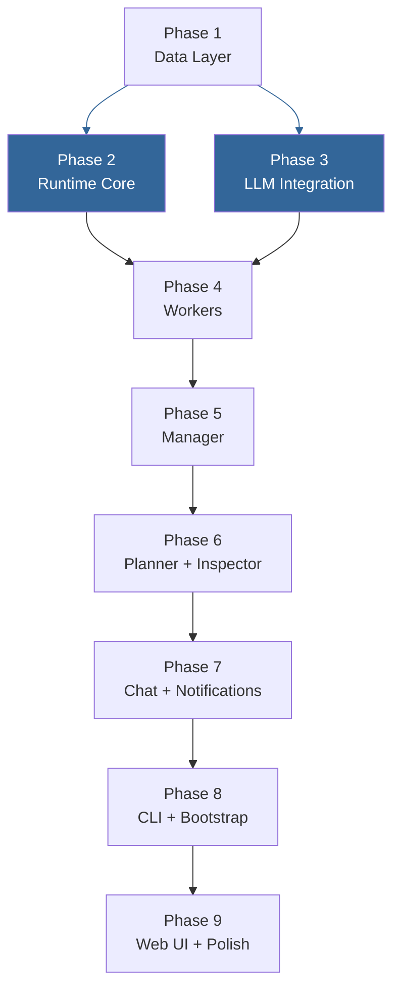

# Saivage v2 — Implementation Plan

Build v2 incrementally on top of the v1 codebase, following the architecture defined in [06-SYSTEM-DESIGN.md](06-SYSTEM-DESIGN.md). Reuse infrastructure that works (providers, MCP, channels, services), replace the orchestrator entirely, and build the new agent hierarchy from the bottom up.

**Approach:** Bottom-up construction. Build the foundation layers first (data, runtime), then agents starting with the simplest (workers), then composite agents (Manager, Planner), then user-facing systems (Chat, notifications), finally CLI and Web UI.

**References:**
- [06-SYSTEM-DESIGN.md](06-SYSTEM-DESIGN.md) — component architecture and interactions
- [01-DATA-MODEL.md](01-DATA-MODEL.md) — TypeScript interfaces and schemas
- [00-AGENT-SYSTEM.md](00-AGENT-SYSTEM.md) — agent behaviors and protocol
- [04-RUNTIME-DETAILS.md](04-RUNTIME-DETAILS.md) — runtime internals
- [05-MCP-SERVICES.md](05-MCP-SERVICES.md) — MCP tool catalog
- [03-PLAN-MCP-SERVICE.md](03-PLAN-MCP-SERVICE.md) — plan MCP specification

---

## Phase 1: Data Layer

Build the **Document Store** and **type system** (06-SYSTEM-DESIGN §2.7).

| Item | File | Description |
|------|------|-------------|
| 1.1 Type definitions | `src/v2/types.ts` | All interfaces from [01-DATA-MODEL.md](01-DATA-MODEL.md) as TypeScript types + Zod schemas for runtime validation |
| 1.2 Document store | `src/v2/store/documents.ts` | Generic JSON CRUD — `read<T>`, `write<T>` (atomic: `.tmp`+rename), `append<T>`, `list`, `delete`. Zod validation on every write |
| 1.3 Project initializer | `src/v2/store/project.ts` | Initialize/discover `.saivage/` directory, load config, resolve paths into `ProjectContext` |
| 1.4 ID generator | `src/v2/ids.ts` | nanoid-based with entity prefixes (`stg-`, `tsk-`, `note-`, `insp-`, `chat-`) |
| 1.5 Tests | | Unit tests for CRUD, atomic writes, validation failures, project init |

**Deliverable:** All document types can be created, read, updated, and validated. Projects initialize cleanly.

---

## Phase 2: Runtime Core

Build the **Runtime Core** (06-SYSTEM-DESIGN §2.1) — the central orchestration engine.

| Item | File | Description |
|------|------|-------------|
| 2.1 Agent interface | `src/v2/agents/types.ts` | Base `Agent` interface, `AgentContext`, `AgentResult` (success/failure/escalation/abort) |
| 2.2 Tool-call dispatcher | `src/v2/runtime/dispatcher.ts` | Nested tool-call pattern: intercept `run_*()` calls → suspend parent → spawn child → resume parent with result. Supports parallel dispatch with resume-on-each |
| 2.3 Plan MCP service | `src/v2/mcp/plan-server.ts` | 11 tools per [03-PLAN-MCP-SERVICE.md](03-PLAN-MCP-SERVICE.md). Atomic writes, schema validation, history append. Built on Document Store from Phase 1 |
| 2.4 Git MCP adaptation | existing `src/services/git/` | Add explicit file staging, `[tsk-<id>]` commit prefix, conflict error returns |
| 2.5 Abort mechanism | `src/v2/runtime/abort.ts` | Detect urgent notes → terminate active chain bottom-up → `git checkout -- .` (tracked files only; untracked left for rollback stage) → Manager writes partial StageSummary (aborted) → Planner resumes. See 06-SYSTEM-DESIGN §4.2 |
| 2.6 Context compaction | `src/v2/runtime/compaction.ts` | Track token usage → trigger at 80% → generate summary message → replace history. Max 3 compactions per conversation. See 06-SYSTEM-DESIGN §4.5 |
| 2.7 Self-check | `src/v2/runtime/self-check.ts` | Inject progress-assessment prompt every N tool-call rounds (configurable per role). Stuck detection → agent failure. See [04-RUNTIME-DETAILS.md](04-RUNTIME-DETAILS.md) §4 |
| 2.8 Crash recovery | `src/v2/runtime/recovery.ts` | On startup: read `runtime.json`, detect stale PID, reconstruct state from disk via plan MCP, reset in-progress tasks to pending. Respect report `status` and verify `commits` before trusting recovered reports. See [04-RUNTIME-DETAILS.md](04-RUNTIME-DETAILS.md) §5.3, §8 |
| 2.9 Note lifecycle | `src/v2/runtime/notes.ts` | Runtime-managed note lifecycle: inject unacknowledged notes into Planner context on resume, set `acknowledged_at` after Planner's next planning action, delete volatile notes after acknowledgment, re-inject permanent notes after compaction. See [04-RUNTIME-DETAILS.md](04-RUNTIME-DETAILS.md) §12 |
| 2.10 Tests | | Unit tests for all subsystems: dispatcher suspend/resume, parallel dispatch, plan MCP CRUD, abort chain, compaction trigger, self-check injection, crash recovery, note lifecycle |

**Deliverable:** The nested tool-call pattern works. Parent agents suspend while children run. Plan state is managed atomically.

See [04-RUNTIME-DETAILS.md](04-RUNTIME-DETAILS.md) for detailed mechanics of suspend/resume, LLM error handling, compaction timing, and self-check injection.

---

## Phase 3: LLM Integration

Build the **LLM Provider Router** integration (06-SYSTEM-DESIGN §2.3) and agent base class with the **Skill System** (06-SYSTEM-DESIGN §2.6).

| Item | File | Description |
|------|------|-------------|
| 3.1 Agent base class | `src/v2/agents/base.ts` | Wraps LLM provider calls (reuse `src/providers/`), assembles context (system prompt + skills + references), manages conversation loop, stash mechanism for large outputs |
| 3.2 Skill loader | `src/v2/skills/loader.ts` | Read `skills/index.json`, trigger matching (keyword/tool/path/tag/agent), `target_agents` filtering, ranking, top-N selection. Adapt from v1 `src/skills/` |
| 3.3 Conventions | `src/v2/agents/conventions.ts` | Per-agent territory definitions. Violation logging (warnings, not blocks). See 06-SYSTEM-DESIGN §1.1 (convention over enforcement) |
| 3.4 Tests | | Integration test: agent base + LLM call + tool execution. Unit tests: skill matching, convention detection |

**Deliverable:** Any agent can be built by extending the base class + defining its prompt and conventions.

> **Note:** Phases 2 and 3 can be worked on in parallel — they share only the agent interface types from 2.1.

---

## Phase 4: Worker Agents

Build the **Coder** and **Researcher** agents (06-SYSTEM-DESIGN §2.2, Coder/Researcher subsections).

| Item | File | Description |
|------|------|-------------|
| 4.1 Coder agent | `src/v2/agents/coder.ts` | System prompt from `prompts/coder.md`. Tools: filesystem, shell, git, web, memory, index. Executes coding tasks, runs tests, writes TaskReport, commits files |
| 4.2 Researcher agent | `src/v2/agents/researcher.ts` | System prompt from `prompts/researcher.md`. Same tools. Writes under `research/` by convention, produces TaskReport |
| 4.3 Tests | | Integration: execute simple task → report → commit. Convention test: researcher territory |

**Deliverable:** Both workers can independently execute tasks and produce reports.

---

## Phase 5: Manager Agent

Build the **Manager** agent (06-SYSTEM-DESIGN §2.2, Manager subsection).

| Item | File | Description |
|------|------|-------------|
| 5.1 Manager agent | `src/v2/agents/manager.ts` | System prompt from `prompts/manager.md`. Receives stage, decomposes into TaskList, dispatches via `run_coder()` / `run_researcher()` (parallel when independent), processes TaskReports, handles failures (retry with modified description / remediate / escalate), writes StageSummary |
| 5.2 Worker integration | | End-to-end: Manager → suspend → Coder runs → TaskReport → Manager resumes. Parallel: Coder + Researcher simultaneous |
| 5.3 Failure handling | | Retry: increment attempt, append failure context to description. Dependency failure cascade. Escalation after max_attempts |
| 5.4 Tests | | Integration: full stage (Manager → Coder → report → summary). Failure: retry + escalation |

**Deliverable:** Complete stage execution loop works end-to-end.

---

## Phase 6: Planner & Inspector

Build the **Planner** and **Inspector** agents (06-SYSTEM-DESIGN §2.2, Planner/Inspector subsections).

| Item | File | Description |
|------|------|-------------|
| 6.1 Planner agent | `src/v2/agents/planner.ts` | System prompt from `prompts/planner.md`. Long-lived conversation. Plan generation via `plan_init()`, stage dispatch via `run_manager()`, stage completion via `plan_complete_stage()`, plan revision via `plan_set_stages()`. Handles escalation, abort, note processing, context compaction |
| 6.2 Inspector agent | `src/v2/agents/inspector.ts` | System prompt from `prompts/inspector.md`. One-shot. Three storage tiers (ephemeral scratch, persistent reports, persistent tools). Writes InspectionReport, promotes tools. Serialized (FIFO queue) |
| 6.3 Runtime integration | | Planner is top-level agent started by bootstrap. On crash, Planner restarts as fresh conversation and reconstructs from disk |
| 6.4 Tests | | Unit: plan generation, stage completion + history, escalation handling. Integration: Planner → Manager → Coder → report → Planner cycle |

**Deliverable:** Full autonomous loop: Plan → Stage → Tasks → Reports → Plan update.

---

## Phase 7: Chat & Notifications

Build the **Chat** agent, **Event Bus**, and channel transports (06-SYSTEM-DESIGN §2.2 Chat, §2.5 Event Bus).

| Item | File | Description |
|------|------|-------------|
| 7.1 Chat agent | `src/v2/agents/chat.ts` | System prompt from `prompts/chat.md`. Tools: Plan MCP (read-only), filesystem (read-only), `create_note(content, permanent?, urgent?)`, `run_inspector()`. Persists dialogue to `tmp/chats/`. One instance per channel, independent of execution |
| 7.2 Event bus & notifier | `src/v2/events/notifier.ts` | In-process pub/sub. 6 event types. Chat agents subscribe on startup, filter by user config, format messages, push to channels. Offline buffer up to 100 events |
| 7.3 Telegram transport | `src/v2/channels/telegram.ts` | Adapt v1. Long-polling for messages, bot API for responses and push notifications |
| 7.4 WebSocket transport | `src/v2/channels/websocket.ts` | Adapt v1. Session timeout: 1hr on disconnect. Buffer events until reconnection |
| 7.5 Tests | | Integration: Chat reads plan, creates note, dispatches Inspector. Notification delivery and filtering |

**Deliverable:** Users can interact with the running system and receive push notifications.

---

## Phase 8: Entry Point & CLI

Build the **bootstrap** sequence and CLI commands (06-SYSTEM-DESIGN §8).

| Item | File | Description |
|------|------|-------------|
| 8.1 Bootstrap | `src/v2/server/bootstrap.ts` | Load global config → discover project → run crash recovery → start channels → start Planner → handle graceful shutdown |
| 8.2 CLI commands | | `init`, `start`, `status`, `note`, `inspect`, `login`, `config`, `models` |
| 8.3 Tests | | Integration: full bootstrap → plan → stage → task → report cycle. Graceful shutdown and restart |

**Deliverable:** Saivage v2 is fully operational from CLI.

---

## Phase 9: Web UI & Polish

Build the web interface and finalize for production (06-SYSTEM-DESIGN §8).

| Item | File | Description |
|------|------|-------------|
| 9.1 Web UI | existing `src/web/` | Adapt to display v2 plan/stages/tasks. Plan timeline, task progress, agent status. Chat via WebSocket |
| 9.2 Telemetry | existing `src/telemetry/` | Adapt to track v2 metrics: stages completed, tasks/stage, failure rate, tokens/agent |
| 9.3 Documentation | | README with setup instructions. Operator guide for config, providers, notifications |

**Deliverable:** Production-ready v2 with web UI and documentation.

---

## Dependency Graph

Phases 2 and 3 can be worked on in **parallel** — they only share the agent interface types (2.1). Everything else is sequential.

---

## v1 Reuse Map

| v1 Module | Disposition | Notes |
|-----------|-------------|-------|
| `src/providers/` | **Keep** | LLM router, all provider abstractions |
| `src/auth/` | **Keep** | Auth flows for all providers |
| `src/mcp/` | **Keep** | MCP client, runtime, registry |
| `src/services/filesystem,shell,web` | **Keep** | No changes |
| `src/services/memory,index` | **Keep** | No changes |
| `src/services/git/` | **Adapt** | Explicit file staging, `[tsk-<id>]` prefix |
| `src/services/skills/` | **Adapt** | `target_agents`, `agent:<type>` trigger |
| `src/channels/` | **Adapt** | Wire to v2 Chat agent |
| `src/generator/` | **Keep** | MCP service scaffold |
| `src/config.ts` | **Adapt** | Split into global + project config |
| `src/log.ts` | **Keep** | Logging |
| `src/orchestrator/` | **Remove** | Replaced by Planner + Manager + Runtime |
| `src/agents/` | **Replace** | New role-based agents (keep stash mechanism) |
| `src/watchdog/` | **Replace** | Replaced by v2 crash recovery |
| `src/services/lock/` | **Remove** | Convention-based territory replaces locking |

---

## Migration Strategy

1. All v2 code goes under `src/v2/` initially, alongside v1 code.
2. Shared modules (`providers/`, `mcp/`, `auth/`, `services/`) stay at current paths — both v1 and v2 import them.
3. Once v2 is functional, delete `src/orchestrator/`, old `src/agents/`, `src/watchdog/`.
4. Move v2 code out of `src/v2/` to top level.
5. Update `src/index.ts` to use v2 bootstrap.

This allows v1 to remain runnable during development for reference and comparison.
