# Saivage v2 — System Design

Comprehensive architecture and component design for the Saivage v2 autonomous software engineering system. This is the primary technical reference — all other specification documents detail specific subsystems described here.

**Companion documents:**

| Doc | Scope |
|-----|-------|
| [00-AGENT-SYSTEM.md](00-AGENT-SYSTEM.md) | Agent roles, behaviors, communication protocol |
| [01-DATA-MODEL.md](01-DATA-MODEL.md) | TypeScript interfaces and JSON schemas |
| [03-PLAN-MCP-SERVICE.md](03-PLAN-MCP-SERVICE.md) | Plan MCP service specification |
| [04-RUNTIME-DETAILS.md](04-RUNTIME-DETAILS.md) | Runtime internals: suspend/resume, retries, compaction |
| [05-MCP-SERVICES.md](05-MCP-SERVICES.md) | Complete MCP service catalog with tool schemas |

---

## 1. System Overview

Saivage v2 is an **autonomous software engineering system** that takes high-level project objectives and executes them through a hierarchy of specialized LLM agents. It manages its own planning, task decomposition, code generation, research, quality assurance, and user communication — running continuously until the objectives are met or the user redirects.

### 1.1 Design Principles

- **Hierarchical delegation**: a chain of command (Planner → Manager → Workers) where each level has well-scoped responsibility and clear contracts.
- **Disk is the source of truth**: all durable state lives on disk as JSON documents. LLM conversations are transient working memory — losing them is always recoverable.
- **Tool-call invocation**: agents communicate exclusively through LLM tool calls. A parent calls a child as a tool, suspends, receives the result when the child finishes. No message queues, no shared memory.
- **Convention over enforcement**: all agents (except Chat) have full filesystem access. Territorial conventions (Coder writes project code, Researcher writes under `research/`) prevent collisions without runtime permission checks.
- **Crash recoverability**: the system can restart at any point and reconstruct its state from disk.
- **Progressive escalation**: failures cascade upward (Worker → Manager → Planner → User) with each level having the opportunity to retry, remediate, or replan.

### 1.2 High-Level Architecture

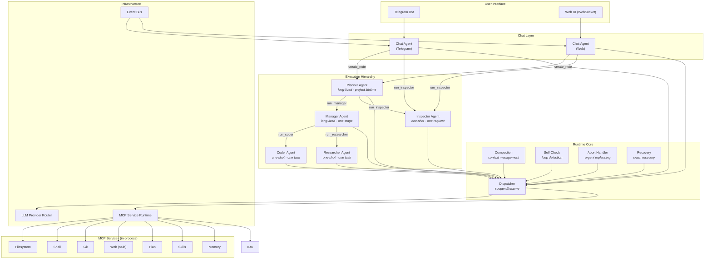

---

## 2. Core Components

### 2.1 Runtime Core

The Runtime Core is the central orchestration engine. It is a **singleton** within the Node.js process and manages the lifecycle of every agent conversation.

**Responsibilities:**
- **Agent lifecycle management**: spawn, suspend, resume, and terminate agent LLM conversations.
- **Tool-call dispatch**: intercept agent-dispatch tool calls (`run_manager`, `run_coder`, etc.), suspend the parent, spawn the child, and inject the child's result back into the parent's conversation when done.
- **Abort handling**: detect urgent user notes, terminate the active agent chain bottom-up, clean the working tree (`git checkout -- .` resets tracked modified files; untracked files are left for the rollback stage), and resume the Planner with the abort context.
- **Context compaction**: track token usage per conversation, trigger compaction when usage exceeds the threshold (default 80%), produce a summary message that replaces the conversation history.
- **Periodic self-check**: inject a progress-assessment prompt after every N tool-call rounds to catch infinite loops.
- **Crash recovery**: on startup, detect stale state from a previous crash, reconstruct the execution position from disk, and restart the Planner.

**Key technical details:**
- Runs on the **Node.js single-threaded event loop**. Concurrency is achieved through async I/O — LLM calls, MCP tool calls, and channel messages are all non-blocking.
- Parent agents are suspended in-memory (full message history + pending tool-call IDs). On crash, this is lost, but disk state is authoritative.
- The Dispatcher supports **resume-on-each** for parallel child dispatch: when the Manager issues both `run_coder()` and `run_researcher()` in one LLM response, both children run concurrently and the Manager resumes independently as each returns. The runtime enforces a maximum of **1 Coder + 1 Researcher** concurrently — excess dispatch calls of the same type are rejected with an error result.

See [04-RUNTIME-DETAILS.md](04-RUNTIME-DETAILS.md) for full suspend/resume mechanics, compaction timing, self-check injection, and failure handling.

### 2.2 Agent System

Six specialized agents, each an LLM conversation with a system prompt, a set of available tools, and a well-defined contract for inputs and outputs.

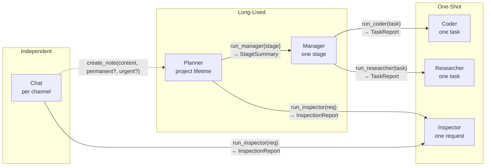

#### Planner
- **Lifetime**: project lifetime (never terminates until objectives are met).
- **Responsibilities**: generate the initial multi-stage plan from project objectives, dispatch stages to the Manager one at a time, process stage results (completed/failed/escalated/aborted), revise the plan adaptively, process user notes, dispatch the Inspector for retrospectives.
- **Tools**: Plan MCP service (full read/write), `run_manager()`, `run_inspector()`, filesystem (read), git (commit `.saivage/` state).
- **State management**: the plan MCP service is the authoritative state store. After compaction, the Planner reconstructs strategic context via `plan_get()` + `plan_get_history()`.

#### Manager
- **Lifetime**: one stage (spawned by Planner, terminates on completion/escalation/abort).
- **Responsibilities**: decompose a stage into an ordered task list, dispatch tasks to Coder/Researcher, process task reports, handle failures (retry with modified description, remediate, escalate), write stage summary.
- **Tools**: `run_coder()`, `run_researcher()`, filesystem (read/write tasks and summaries), git (commit `.saivage/stages/`).
- **Parallel dispatch**: can issue one Coder + one Researcher task concurrently when tasks are independent. Resumes as each returns.
- **Failure handling**: on task failure, increments `task.attempt`, appends failure context to description, retries. If `attempt >= max_attempts`, escalates. If a dependency task fails, cascades failure to all dependents.

#### Coder
- **Lifetime**: one task (spawned by Manager).
- **Responsibilities**: execute coding/testing/documentation tasks, write code, run tests, commit changes, produce a TaskReport with checklist results.
- **Tools**: filesystem (read/write), shell (run commands/tests), git (commit own files), web (read docs), memory, index.
- **Territory**: project source code. Commits project files + task report.

#### Researcher
- **Lifetime**: one task (spawned by Manager).
- **Responsibilities**: gather information from external sources, organize findings under `research/`, produce a TaskReport.
- **Tools**: same as Coder.
- **Territory**: `research/` directory. Writes under `research/` by convention.

#### Inspector
- **Lifetime**: one investigation (spawned by Planner or Chat).
- **Responsibilities**: deep analysis of project state — code quality, test coverage, architecture review, performance — producing an InspectionReport with findings and recommendations.
- **Tools**: filesystem (read/write), shell (run analysis), git, web.
- **Three storage tiers**: ephemeral workspace (`tmp/inspector-workspace/<report-id>/`), persistent reports (`inspections/`), persistent tools (`tools/inspector/`). Can promote useful tools from scratch to persistent.
- **Serialized**: only one Inspector runs at a time (FIFO queue if Planner and Chat both request simultaneously).

#### Chat
- **Lifetime**: per channel, runs independently of the execution hierarchy.
- **Responsibilities**: answer user queries about project state, relay user direction to the Planner via notes, dispatch Inspector on user request, push notifications for system events.
- **Tools**: Plan MCP (read-only), filesystem (read-only), `run_inspector()`, `create_note(content, permanent?, urgent?)`.
- **Channels**: Telegram (long-polling) and Web UI (WebSocket). One Chat agent instance per channel.
- **Does not block** the execution pipeline. Cannot directly modify project code or plan state — its only write operations are creating user notes and dispatching the Inspector.

Full agent behaviors, inputs, outputs, and trigger events are specified in [00-AGENT-SYSTEM.md](00-AGENT-SYSTEM.md).

### 2.3 LLM Provider Router

The Provider Router manages all LLM API communication. It is a **singleton** reused from v1.

**Responsibilities:**
- **Model selection**: for each agent role, select the model from configuration. Precedence: `ProjectConfig.model_overrides[role]` → `RuntimeConfig.providers[name].models[role]` → most capable available.
- **Retry with backoff**: all retryable errors (HTTP 429, 5xx, timeouts) are retried with exponential backoff (1s→60s, ±20% jitter). Retries are bounded by a maximum retry duration per request (default: 10 minutes). If exceeded, the error is surfaced as an agent failure. Provider failover may resolve the issue before the timeout.
- **Provider failover**: if a provider fails 5+ consecutive times within 2 minutes, switch to the configured failover provider. Try the primary again on the next agent invocation.
- **Request timeout**: configurable per provider (default: 120s).

**Non-retryable errors** (surfaced as agent failure): HTTP 400 (bad request), HTTP 401/403 (auth failure), context window exceeded.

See [04-RUNTIME-DETAILS.md](04-RUNTIME-DETAILS.md) §2 for retry details and invalid tool-call handling.

### 2.4 MCP Service Runtime

The MCP Service Runtime manages the lifecycle of MCP service child processes. It is a **singleton** reused from v1.

**Responsibilities:**
- **Lazy startup**: services are started on first tool call, not at boot.
- **Health monitoring**: periodic health checks. Dead services are restarted automatically.
- **Idle shutdown**: services unused for a configurable period are stopped to free resources.
- **Crash recovery**: tracks crash count per service. Restarts on next tool call.
- **In-process services**: the agent-dispatch tools (`run_manager`, `run_coder`, etc.) are registered as in-process handlers — no subprocess overhead.
- **Tool routing**: `callTool(service, tool, args)` routes to the correct service, starting it if needed.

**Services available:** filesystem, shell, git, web, plan, skills, memory, index. Services communicate via stdio using the MCP SDK protocol. Full tool schemas and access matrix in [05-MCP-SERVICES.md](05-MCP-SERVICES.md).

### 2.5 Event Bus & Notification System

An in-process pub/sub bus that connects runtime events to user-facing channels.

**Responsibilities:**
- **Event publishing**: the runtime publishes events when significant things happen (stage completed, task failed, escalation, Inspector report ready, plan updated).
- **Chat subscription**: each Chat agent subscribes on startup. When an event arrives, the Chat agent checks the user's notification filters (min_severity, category whitelist) and formats a concise push message.
- **Channel delivery**: Telegram via bot API `sendMessage`, Web via WebSocket push.
- **Offline buffering**: if a channel is disconnected, buffer up to 100 events. On overflow, drop oldest with a summary message. Deliver buffered events on reconnection.

**Event types:**

| Event | Published when | Severity |
|-------|---------------|----------|
| `stage_completed` | Manager returns success | info |
| `stage_failed` | Manager fails unrecoverably (runtime error, not escalation) | error |
| `escalation` | Manager escalates to Planner | warning |
| `task_failed` | Worker returns failure | warning |
| `inspector_complete` | Inspector returns report | info |
| `plan_updated` | Planner modifies the plan | info |

### 2.6 Skill & Memory System

Skill and memory records share one document-store substrate, one Zod base (`RecordBase`), one append-only audit log, and one permission engine in `src/knowledge/`. They diverge on default surfacing mode: skills are eagerly injected into agent system prompts at construction time; memories are on-demand lookup (or eager when `target_agents` is non-empty). Full design: [SPEC/v2/skills-memory/01-DESIGN.md](skills-memory/01-DESIGN.md).

**Authoring surface** (design §C.1). Sixteen MCP tools — eight per kind — backed by a shared store/permissions engine: `create_*`, `read_*` / `get_*`, `list_*`, `search_*`, `update_*`, `supersede_*`, `archive_*`, `delete_*`. Direct filesystem writes under `.saivage/{skills,memory}/` are rejected by `fsGuard` from every role. Authorization is enforced at the MCP runtime via `ToolCallContext` + `permissions.canCall`, not by handler convention.

**Built-in vs project skills.** Built-in skills ship at `saivage/skills/builtin/<topic>/SKILL.md` with YAML frontmatter, walked by `src/knowledge/builtinWalker.ts`, and have `origin="builtin"`, `scope="project"`. Project skills are authored at runtime via `create_skill` (no frontmatter — fields live in the JSON record).

**Eager-injection algorithm** (design §D.1). When a `BaseAgent` is constructed, the knowledge loader:

1. Collects candidates from four sources: built-in skills (frontmatter walk), `skills/project/index.json`, `skills/stages/<ctx.stage_id>/index.json`, `skills/sessions/<ctx.channel_id>/index.json`, plus memory records (in the same scope tree) whose `target_agents` is non-empty.
2. Filters to `status == "active"` and `target_agents` matching the current agent role (empty `target_agents` = any role).
3. Scores skills against `keyword:` / `tag:` / `agent:` triggers only. Triggerless skills score 0 (FR-8): not eager-injected, but findable via `search_skills`. Memories score 1 when eligible.
4. Sorts: origin precedence (project > builtin) → score desc → `updated_at` desc → `id` asc.
5. Splits the result into the **two-tier budget** (§D.2).

**Two-tier budget** (design §D.2). The eager block is **survivor reinjection** + **ordinary eager records**:

- **Survivor sub-budget — always-on, summary form.** Records with `survive_compaction: true` (skills + project-scoped memories) are always included as one-line summaries (no token cap — this is the FR-15 contract). Per-record hard ceiling 4096 tokens post-summarization; `create_*` / `update_*` rejects oversize records (`OVERSIZED_SURVIVOR`); load-time corruption quarantines the record but echoes its id in the block header.
- **Ordinary eager sub-budget — token cap.** Default 2048 tokens per agent (configurable via `ctx.project.config.skills.eager_budget_tokens`). Token estimation uses `length / 4`, matching `compaction.ts` `estimateTokens`. Records are appended in rank order; overflow records are dropped (not truncated) and their ids are echoed in the block header `omitted: [...]` so the agent can retrieve them via `read_skill` / `get_memory`.

Survivor reinjection (post-compaction) is unconditional — the ordinary token cap does **not** apply to survivors.

**Canonical normalization** (design §D.3). `search_skills` and `search_memories` apply universal normalization to both query and indexed text: NFC unicode normalize → lowercase → strip ASCII punctuation `[^\w\s]` (replace with space) → collapse whitespace → split on whitespace. Match is **exact token equality** after normalization (no substring, no stemming). The per-scope `index.json` caches the first 500 chars of every record body as `body_snippet` so search never touches body files on the hot path; full bodies load only via `read_skill` / `get_memory`. Stable ordering: score desc → `updated_at` desc → `id` asc.

**Lifecycle & decay.** Records transition `active` → `superseded` (via `supersede_*`) | `archived` (via `archive_*`, reversible with `unarchive_*`) | `expired` (sweeper). `delete_*` writes a tombstone + audit. Stage-terminal transitions archive their stage-scoped subtree; chat-channel close archives the session subtree. TTL is project-scope only; the sweeper runs on-load lazily, transitions under the per-record mutex, and never races authoring writes.

**Cross-references and scope rules** are in design §B.5 (allowed supersession pairs — scope may widen but never narrow). Permissions matrix (9 roles × per-operation per-kind) is design §F. On-disk layout is design §B.4 (mirrored in [SPEC/v2/01-DATA-MODEL.md](01-DATA-MODEL.md) §10).

### 2.7 Document Store

A generic CRUD layer for all JSON documents on disk.

**Responsibilities:**
- **Atomic writes**: every write goes to a `.tmp` file first, then is renamed into place. No partial writes on crash.
- **Schema validation**: every document is validated against its Zod schema before write. Invalid data is rejected.
- **CRUD operations**: `read<T>(path)`, `write<T>(path, data)`, `append<T>(path, item)`, `list(dir)`, `delete(path)`.
- **Project context**: bundles project root, config, and resolved paths for all downstream components.

---

## 3. Data Architecture

### 3.1 Storage Layout

All Saivage state lives inside `<project>/.saivage/`.

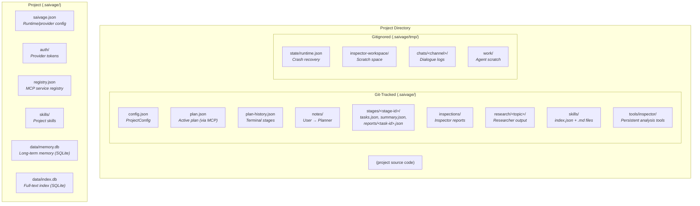

### 3.2 Data Sovereignty Rules

Each data domain has a single owner and a defined access pattern:

| Data | Owner | Written by | Read by | Storage |
|------|-------|-----------|---------|---------|
| `plan.json`, `plan-history.json` | Plan MCP service | Planner (via MCP tools) | Planner, Chat | Git-tracked |
| `stages/<id>/tasks.json` | Manager | Manager | Manager, Planner (via summary) | Git-tracked |
| `stages/<id>/summary.json` | Manager | Manager | Planner | Git-tracked |
| `stages/<id>/reports/<id>.json` | Worker | Coder/Researcher | Manager | Git-tracked |
| `notes/<id>.json` | Chat | Chat (via `create_note`); Runtime (acknowledgment, cleanup) | Planner (via runtime injection) | Git-tracked |
| `inspections/<id>.json` | Inspector | Inspector | Planner, Chat | Git-tracked |
| `research/<topic>/` | Researcher | Researcher | Any agent | Git-tracked |
| `skills/` | Coder | Coder (when tasked) | All agents (via loader) | Git-tracked |
| `tools/inspector/` | Inspector | Inspector | Inspector | Git-tracked |
| `tmp/state/runtime.json` | Runtime | Runtime Core | Runtime (recovery) | Gitignored |
| `tmp/chats/` | Chat | Chat | Chat | Gitignored |
| Project source code | Coder | Coder | Any agent | Git-tracked |
| Git history | Git MCP | All agents (via MCP) | All agents | Git |

**Key rules:**
- No agent reads or writes `plan.json` or `plan-history.json` directly — all access goes through the Plan MCP service.
- No agent calls `git` CLI directly — all git operations go through the Git MCP service.
- Conversations are ephemeral. Disk is the source of truth. On crash, all conversations are lost and reconstructed from files.

### 3.3 Document Relationships

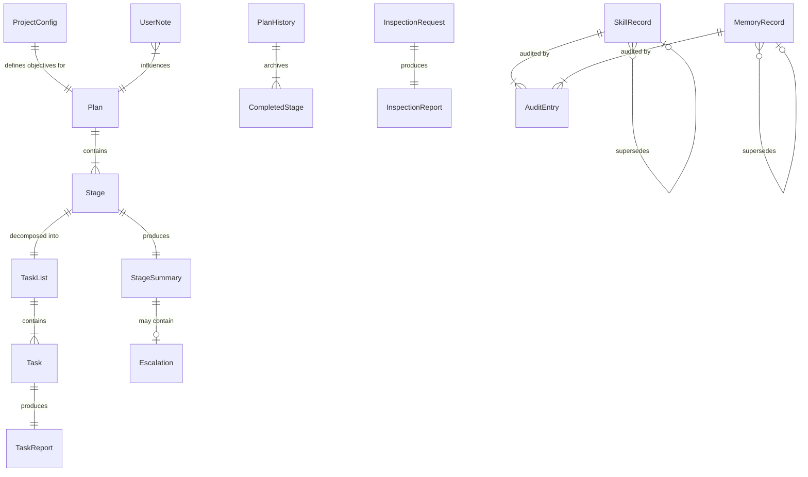

Full TypeScript interfaces for all document types in [01-DATA-MODEL.md](01-DATA-MODEL.md).

---

## 4. Execution Model

### 4.1 Main Execution Loop

The system runs as a **nested tool-call chain**. The Planner is the top-level agent; all others are children invoked as tools.

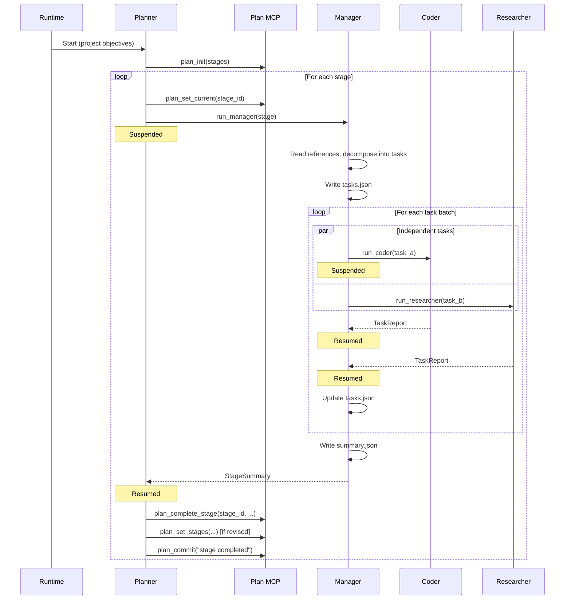

### 4.2 Abort & Replanning

When the user sends an urgent note, the runtime aborts the active agent chain and returns control to the Planner.

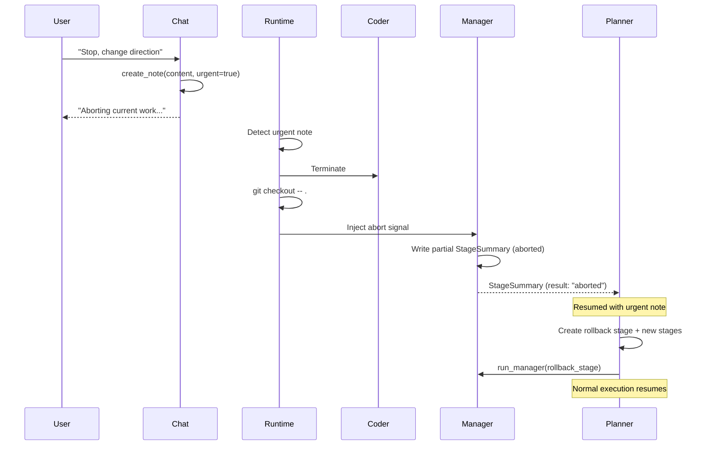

### 4.3 Error Escalation

Failures cascade upward through the hierarchy, with each level having the opportunity to handle them.

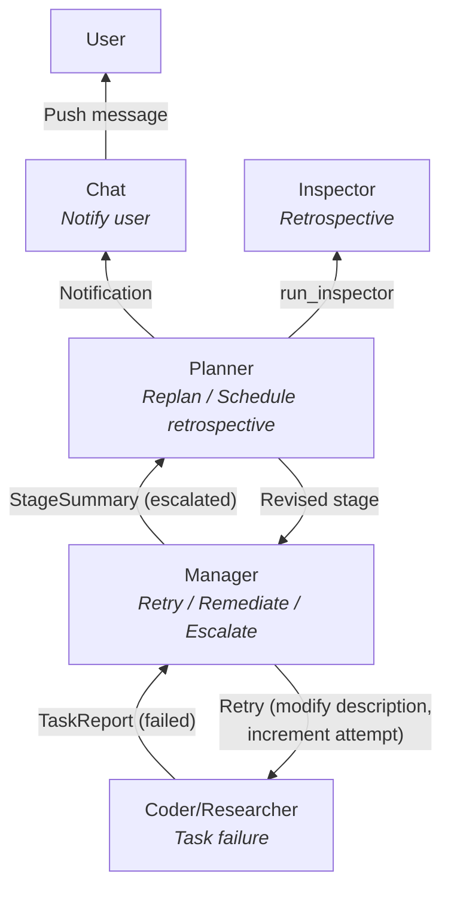

### 4.4 User Interaction

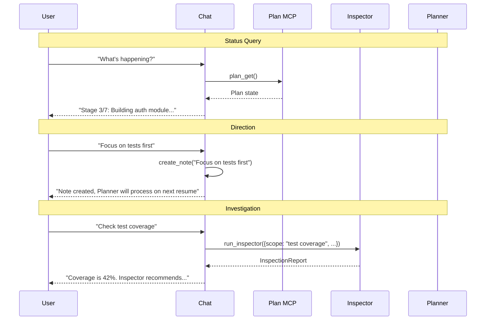

### 4.5 Context Compaction

Applies to **all agents** when their conversation approaches the context window limit.

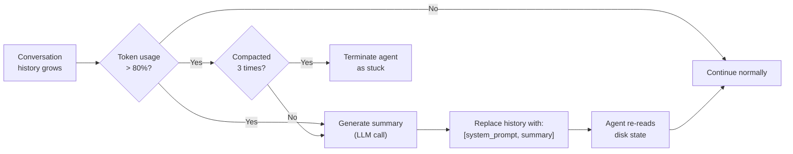

**Safety net order:** self-check (N rounds) → compaction (80% context) → max compactions (3) → forced termination.

---

## 5. MCP Services

The system interacts with external resources (filesystem, git, web) and manages internal state (plan, skills, memory) through **MCP services** — child processes that expose tools via the MCP SDK stdio protocol.

### 5.1 Service Overview

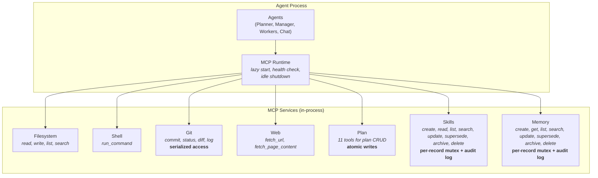

**Key design decisions:**
- **Git is serialized**: the Git MCP processes one tool call at a time. This eliminates race conditions — no locking needed.
- **Plan is atomic**: all plan writes use temp-file + rename. Schema validation on every write.
- **Services are lazy**: started on first tool call, shut down after idle timeout.
- **Generated services**: agents can create new MCP services at runtime using the v1 scaffold system, for project-specific tooling.

### 5.2 Agent → Service Access

| Service | Planner | Manager | Coder | Researcher | Inspector | Chat |
|---------|:-------:|:-------:|:-----:|:----------:|:---------:|:----:|
| Filesystem (read) | ✓ | ✓ | ✓ | ✓ | ✓ | ✓ |
| Filesystem (write) | — | ✓ | ✓ | ✓ | ✓ | — |
| Shell | — | — | ✓ | ✓ | ✓ | — |
| Git | ✓ | ✓ | ✓ | ✓ | ✓ | — |
| Web | — | — | ✓ | ✓ | ✓ | — |
| Plan (read) | ✓ | — | — | — | — | ✓ |
| Plan (write) | ✓ | — | — | — | — | — |
| Skills | see [05-MCP-SERVICES.md](05-MCP-SERVICES.md) §6 + design [§F](skills-memory/01-DESIGN.md) |
| Memory | see [05-MCP-SERVICES.md](05-MCP-SERVICES.md) §7 + design [§F](skills-memory/01-DESIGN.md) |

Skills & memory ACL is enforced at the MCP runtime (`ToolCallContext` + `permissions.canCall`) per-tool per-role; the matrix is not summarizable in one row. Full 9-role × per-operation table in [SPEC/v2/skills-memory/01-DESIGN.md](skills-memory/01-DESIGN.md) §F.

Full tool schemas, parameters, and return values in [05-MCP-SERVICES.md](05-MCP-SERVICES.md).
Plan MCP service specification in [03-PLAN-MCP-SERVICE.md](03-PLAN-MCP-SERVICE.md).

---

## 6. Concurrency Model

### 6.1 Single-Threaded Async

Saivage runs on the **Node.js single-threaded event loop**. All concurrency is cooperative async I/O:

- **LLM API calls**: the main source of async work. While waiting for one agent's response, another agent's response can arrive.
- **MCP tool calls**: child process communication via stdio pipes is async.
- **Channel messages**: Telegram polling and WebSocket events are async.

### 6.2 Active Agent Tree

At any point in time, only **leaf agents** are actively making LLM calls. Parent agents are suspended in memory.

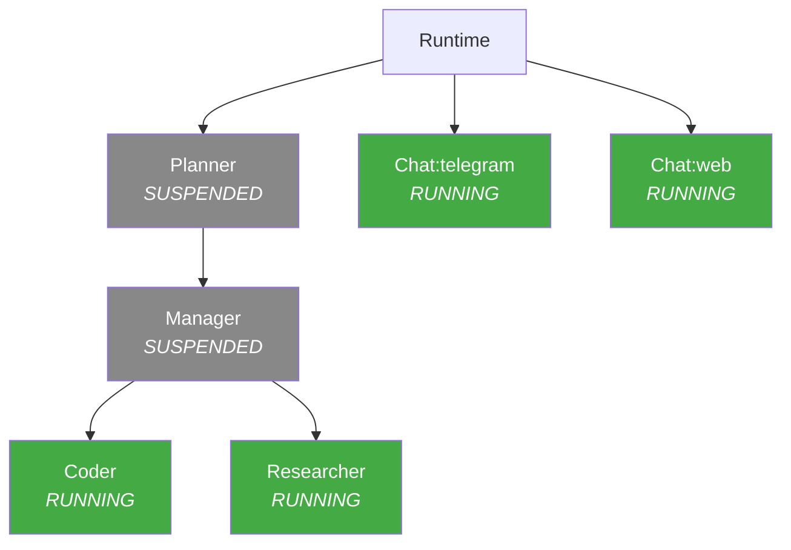

### 6.3 Race Condition Prevention

| Shared resource | Protection mechanism |
|----------------|---------------------|
| Git repository | Serialized through Git MCP (one call at a time) |
| plan.json | Serialized through Plan MCP (one call at a time) |
| File writes | Atomic temp-file + rename |
| Agent territories | Convention-based (Coder=project code, Researcher=research/) |

The **1 Coder + 1 Researcher** limit is enforced by the runtime, not just by convention. If the LLM emits duplicate dispatch calls of the same type, the excess calls are rejected.

---

## 7. Persistence & Recovery

### 7.1 Crash Recovery

On process restart, the system reconstructs its position from disk:

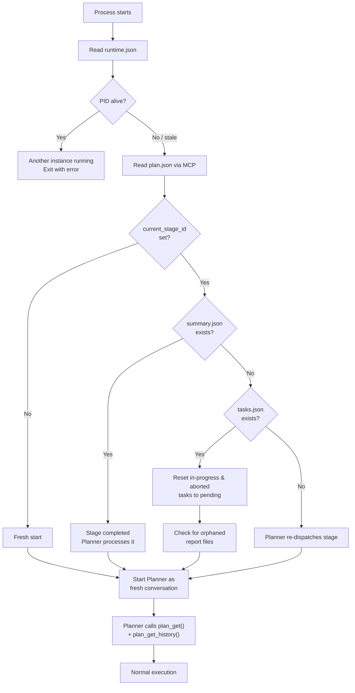

### 7.2 What Survives a Crash

| State | Survives? | How |
|-------|-----------|-----|
| Plan (stages, history) | ✓ | plan.json, plan-history.json on disk |
| Task list and status | ✓ | tasks.json on disk |
| Task reports | ✓ | reports/<task-id>.json on disk |
| Stage summaries | ✓ | summary.json on disk |
| Inspection reports | ✓ | inspections/<id>.json on disk |
| Git commits | ✓ | Git history |
| Uncommitted file changes | ✓ | Working tree (unless aborted) |
| Agent conversations | ✗ | In-memory only. Reconstructed from disk. |
| Event bus state | ✗ | In-memory only. Events re-publish on reconnection. |

---

## 8. Deployment

### 8.1 Runtime Environment

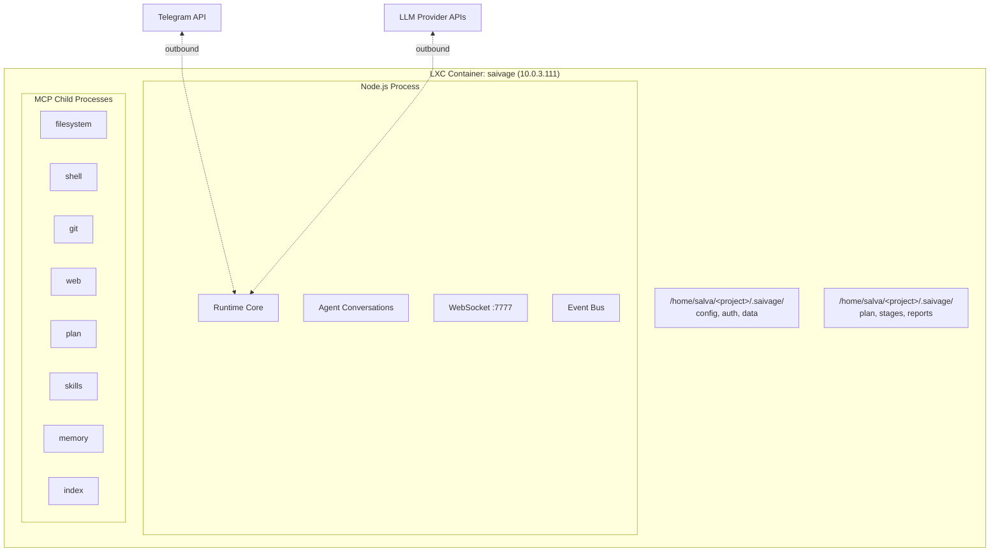

### 8.2 Configuration

**Project-local configuration:**

- **Runtime/provider config** (`<project>/.saivage/saivage.json`): LLM provider credentials (API keys, model assignments per role, timeout, failover), Telegram bot token and user ID, auth directory.
- **Project config** (`<project>/.saivage/config.json`): project name and objectives, provider selection, model overrides, notification preferences (channels, severity filters, category filters), skill loading budget, per-agent tuning (compaction threshold, self-check frequency, max compactions).

Full schema in [01-DATA-MODEL.md](01-DATA-MODEL.md) §1-2.

### 8.3 Build & Deploy

```bash
npm run build               # TypeScript → dist/
make -C deploy deploy       # rsync + npm ci + build + systemctl restart
```

### 8.4 CLI

| Command | Description |
|---------|-------------|
| `init <project-path>` | Initialize `.saivage/` directory structure |
| `start <project-path>` | Start the execution loop |
| `status <project-path>` | Show current plan, stage, tasks |
| `note <project-path> <msg>` | Create a user note directly |
| `inspect <project-path> <scope>` | Dispatch Inspector from CLI |
| `login` | Authenticate with LLM provider |
| `config` | Manage global configuration |

---

## 9. Safety & Reliability

### 9.1 Defense in Depth

Multiple layers prevent runaway agents, data corruption, and unrecoverable failures:

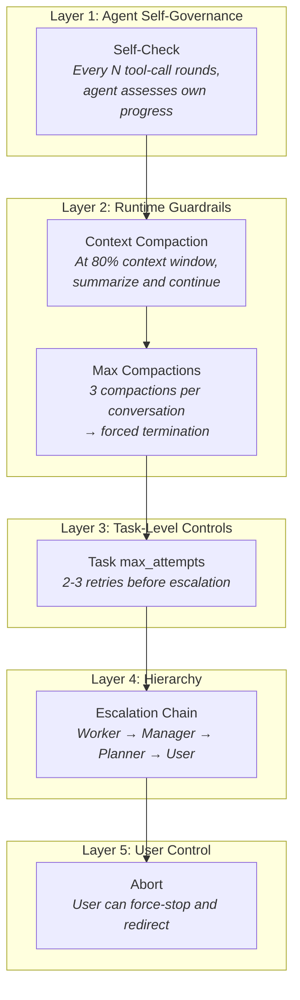

### 9.2 Fault Tolerance

| Failure | Recovery mechanism |
|---------|-------------------|
| LLM API timeout / 5xx | Exponential backoff, unlimited retries |
| LLM API 400 (bad request) | Agent returns failure to parent |
| LLM provider persistently down | Failover to backup provider |
| Invalid tool call from LLM | Error result returned to LLM (self-corrects); 3 consecutive failures → agent failure |
| MCP service crash | Auto-restart on next tool call |
| Agent infinite loop | Self-check → compaction → max compactions → forced termination |
| Process crash | Disk-based recovery on restart |
| User abort | `git checkout -- .`, rollback stage, replan |
| Git conflict | Agent reports failure; Manager creates resolution task or escalates |

### 9.3 Auditability

Every agent action produces a persistent, git-committed artifact:

- **Planner**: `plan.json`, `plan-history.json` (committed via `plan_commit()`)
- **Manager**: `tasks.json`, `summary.json` (committed via git MCP)
- **Workers**: task reports + git commits with `[tsk-<id>]` prefix
- **Inspector**: `inspections/<id>.json` + tools under `tools/inspector/`
- **Chat**: dialogue logs in `tmp/chats/` (ephemeral but persisted across sessions)

The git log provides a complete, append-only timeline of all changes.

---

## 10. v1 → v2 Migration

### 10.1 What Changes

| Aspect | v1 | v2 |
|--------|----|----|
| **Architecture** | Flat orchestrator + agents | Hierarchical: Planner → Manager → Workers |
| **Planning** | Single-level TODO list | Multi-stage plan with history and acceptance criteria |
| **Agent lifecycle** | All one-shot | Mixed: Planner (project), Manager (stage), Workers (task) |
| **Concurrency** | Sequential tasks only | 1 Coder + 1 Researcher in parallel |
| **State management** | In-memory + orchestrator | Disk-authoritative, crash-recoverable |
| **Git access** | Direct CLI | MCP-serialized, explicit file staging |
| **User interaction** | Chat reads orchestrator state | Chat reads plan/tasks, creates notes, dispatches Inspector |
| **Error handling** | Agent retries only | Multi-level: retry → remediate → escalate → replan → notify |
| **Quality assurance** | None | Inspector agent with 3-tier storage |
| **Context management** | None | Compaction + self-check + max compactions |

### 10.2 v1 Component Reuse (completed)

| v1 Component | v2 Disposition |
|-------------|---------------|
| `src/providers/` | **Kept** — model router, all provider abstractions |
| `src/auth/` | **Kept** — auth flows |
| `src/mcp/` | **Kept** — client, runtime, registry |
| `src/services/*` | **Replaced** — core services (filesystem, shell, git, skills) reimplemented as in-process handlers in `src/mcp/builtins.ts`; web/memory/index/lock registered as stubs |
| `src/channels/` | **Adapted** — wired to v2 Chat agent |
| `src/generator/` | **Removed** — MCP service scaffold no longer needed (in-process model) |
| `src/orchestrator/` | **Removed** — replaced by Planner + Manager + Runtime |
| `src/agents/` | **Replaced** — new role-based agents |
