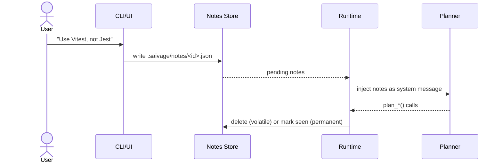

# User Notes & Steering

User notes are the canonical mechanism for steering Saivage while it runs.
They are JSON files under `.saivage/notes/`, queued for the Planner to read
the next time it resumes.

## Lifecycle



A note has these fields (`UserNoteSchema` in `src/types.ts`):

| Field | Type | Description |
|-------|------|-------------|
| `id` | string | Unique note id. |
| `channel` | string | Origin (`web`, `telegram`, `cli`). |
| `session_id` | string | Originating chat session (`cli` for CLI-created notes). |
| `content` | string | Free-form text. |
| `created_at` | ISO timestamp | |
| `permanent` | boolean | Persists across replans (lightweight objective tweak). |
| `urgent` | boolean | Marks the note high priority for the next Planner turn. |
| `acknowledged_at` | ISO timestamp? | Set after the Planner consumes the note. |

## Sending notes

### CLI

```bash
saivage note ./myproject "Use Vitest, not Jest"
saivage note ./myproject "Add docstrings to public APIs" --permanent
saivage note ./myproject "Stop everything; the prod schema changed" --urgent
```

### Web UI / Telegram

Type a message into the chat box. Actionable free-text direction is relayed to
the Planner through `create_note()`:

- Direction changes become permanent notes.
- High-priority direction can set `urgent: true`; this does not interrupt
   running work.
- Questions can be answered directly without writing a note.

Slash commands provide deterministic note actions: `/note <msg>`, `/note!
<msg>`, `/notep <msg>`, and `/replan [reason]`. Planner restart is explicit:
use `/restart-planner <reason>`.

## Behavior on the Planner side

The runtime feeds pending notes into the Planner's context as a synthetic
system message at the start of each Planner turn. The Planner is then free
to:

- Adjust the plan (`plan_set_stages`, `plan_add_stage`, `plan_remove_stage`).
- Acknowledge and proceed.
- Dispatch the Inspector for further analysis.

The Planner does **not** write to note files. Acknowledgement is performed
by the runtime: volatile notes are deleted after the Planner makes a planning
move; permanent notes are kept and re-injected on each resume so they remain
in scope.

## Urgent Notes & Planner Restart

When `urgent: true`, the note is tagged as high priority in the Planner's next
injected note block. It does not cancel the active Planner, Manager, or worker
chain, and it does not run a git reset.

To interrupt the current Planner turn from chat, use `/restart-planner
<reason>`. The runtime cancels that Planner turn and starts a fresh Planner from
persisted state; worker-chain abort/recovery is a separate runtime path.

## Permanent notes & objectives

A permanent note acts as a soft objective amendment without rewriting
`config.json`. Use them for evolving constraints (*"prefer functional
style"*, *"target Node 22"*). The Planner re-reads them on every plan turn.
