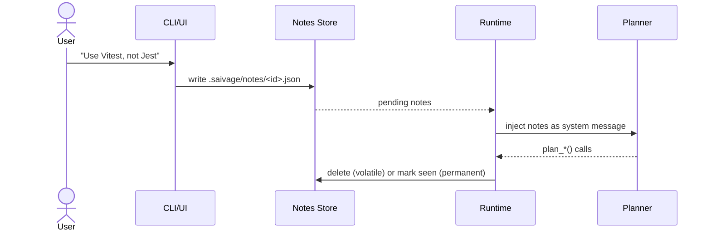

# User Notes & Steering

User notes are the canonical mechanism for steering Saivage while it runs.
They are JSON files under `.saivage/notes/`, queued for the Planner to read
the next time it resumes.

## Lifecycle



A note has these fields (`UserNoteSchema` in `src/types.ts`):

| Field | Type | Description |
|-------|------|-------------|
| `id` | string | Unique note id. |
| `channel` | string | Origin (`web`, `telegram`, `cli`). |
| `session_id` | string | Originating chat session, if any. |
| `content` | string | Free-form text. |
| `created_at` | ISO timestamp | |
| `permanent` | boolean | Persists across replans (lightweight objective tweak). |
| `urgent` | boolean | Aborts the active agent chain and replans immediately. |

## Sending notes

### CLI

```bash
saivage note ./myproject "Use Vitest, not Jest"
saivage note ./myproject "Add docstrings to public APIs" --permanent
saivage note ./myproject "Stop everything; the prod schema changed" --urgent
```

### Web UI / Telegram

Type a message into the chat box. The Chat agent decides whether and how
to convert it into a note:

- A simple instruction → an immediate note via `create_note()`.
- A question → answered directly without writing a note.
- An "abort" or "stop" → `create_note()` with `urgent: true`.

You can also explicitly request *"create an urgent permanent note: …"* —
the Chat agent's tool grammar supports both flags.

## Behavior on the Planner side

The runtime feeds pending notes into the Planner's context as a synthetic
system message at the start of each Planner turn. The Planner is then free
to:

- Adjust the plan (`plan_set_stages`, `plan_add_stage`, `plan_remove_stage`).
- Acknowledge and proceed.
- Dispatch the Inspector for further analysis.

The Planner does **not** write to note files. Acknowledgement is performed
by the runtime: volatile notes are deleted after the Planner makes a planning
move; permanent notes are kept and re-injected on each resume so they remain
in scope.

## Urgent notes & abort

When `urgent: true`:

1. The runtime sets the abort flag.
2. The currently running agent chain (Manager → Coder/Researcher) is
   terminated bottom-up at the next safe point.
3. `git checkout -- .` is run inside the project to reset tracked
   modifications. Untracked files are preserved.
4. The Planner is resumed with the abort context plus the urgent note.

See [Abort & Recovery](/internals/abort-recovery) for full mechanics.

## Permanent notes & objectives

A permanent note acts as a soft objective amendment without rewriting
`config.json`. Use them for evolving constraints (*"prefer functional
style"*, *"target Node 22"*). The Planner re-reads them on every plan turn.
