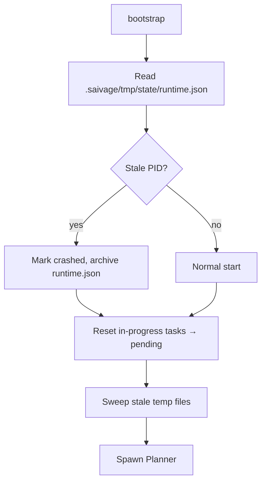

# Abort & Recovery

Two related mechanisms ensure the runtime survives unexpected events:

- **Abort** ([`src/runtime/abort.ts`](https://github.com/salva/saivage/blob/main/src/runtime/abort.ts))
  — controlled termination of the active agent chain, triggered by an
  urgent user note or a supervisor verdict.
- **Recovery** ([`src/runtime/recovery.ts`](https://github.com/salva/saivage/blob/main/src/runtime/recovery.ts))
  — startup-time reconciliation of disk state after a crash.

## Abort

### Trigger sources

- **Urgent user note** (`urgent: true`) — surfaced by the Notes scanner.
- **Supervisor decision** — see [Supervisor](./supervisor).
- **Programmatic** — `runtime.abort(reason)` from the public API.

### Procedure

1. `AbortSignal.aborted = true`. The signal is shared with all running
   agents through their context.
2. Each agent's `BaseAgent.run` loop checks the flag between tool rounds.
   On detect:
   - Workers — write a partial `TaskReport` with `status: "failed"`,
     `failure_reason: "aborted"` and return.
   - Manager — wait for in-flight workers to abort, then write
     `summary.json` with `result: "aborted"` and return.
   - Planner — does not abort (it's the recipient of the abort).
3. Abort runs **bottom-up**. The Manager only writes its summary after
   its workers have come back.
4. After the chain unwinds, the runtime runs `git checkout -- .` inside
   the project to reset tracked-but-modified files. Untracked files are
   preserved — they may contain in-progress experiments worth keeping.
5. The Planner is resumed with the abort context (the urgent note + a
   summary of what was rolled back) prepended as a system message.

### Files preserved across abort

- Anything under `.saivage/` (plans, tasks, summaries).
- Untracked files anywhere in the working tree.
- Committed work — abort never rewrites history.

### Files lost across abort

- Tracked, modified, uncommitted work in the project tree (reverted by
  `git checkout`).
- Worker-process LLM conversation memory (workers are one-shot; never
  durable).

## Recovery

Triggered by `bootstrap()` on every startup.

A "stale PID" is a runtime.json with status `"running"` whose PID no longer
exists. Recovery archives the file (as `runtime.crashed.<ts>.json`) for
forensic purposes, then proceeds.

`Recovery` also:

- Resets `tasks.json` entries with `status: "in-progress"` to `"pending"`
  for every active stage (so the next Manager redispatches them).
- Sweeps stale tmp files (`sweepStaleTempFiles` in
  `src/store/documents.ts`).
- Reads any `shutdown-summary.json` written by a previous graceful shutdown
  and surfaces the reason to the Planner on resume — see
  [Supervisor & Shutdown Handoff](./supervisor).
