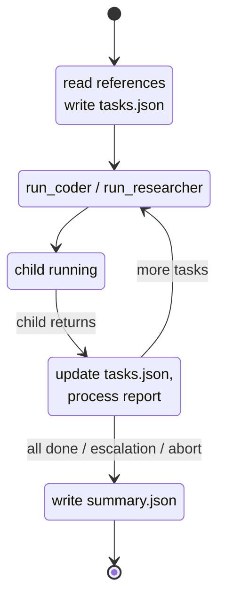

# Manager

[`src/agents/manager.ts`](https://github.com/salva/saivage/blob/main/src/agents/manager.ts)
· spec [§2.2](https://github.com/salva/saivage/blob/main/SPEC/v2/00-AGENT-SYSTEM.md#22-manager)

A new Manager is spawned for each stage. It owns the stage's task list and
worker dispatch loop.

## Inputs

- `Stage` (passed by the Planner).
- `references[]` documents (read via filesystem MCP at the start of the
  conversation).

## Outputs

- `stages/<stage-id>/tasks.json` (`TaskList`).
- `stages/<stage-id>/reports/<task-id>.json` (`TaskReport`s).
- `stages/<stage-id>/summary.json` (`StageSummary`) — the value returned
  to the Planner.

## Lifecycle

## Parallelism

The Manager may issue **one Coder + one Researcher** in a single LLM
response. The Dispatcher detects this and spawns both children
concurrently, resuming the Manager as each child returns
(*resume-on-each*). Issuing two of the same role in one turn is rejected
with an error tool result.

## Failure handling

For each `TaskReport` with `status: "failed"`:

1. Increment `task.attempt`.
2. Append failure context to the description.
3. If `attempt < max_attempts` → retry.
4. Otherwise → escalate to the Planner. Escalation terminates the Manager.
5. If a *dependency* task failed, the Manager cascades failure to all
   dependents (without dispatching them).

`max_attempts` defaults to 3 and can be overridden in the system prompt
(via skills) or in stage description metadata.

## Termination contracts

| Outcome | `summary.json.result` | Manager terminates? |
|---------|----------------------|---------------------|
| All tasks completed | `completed` | yes |
| Escalation to Planner | `escalated` | yes |
| Aborted (urgent note) | `aborted` | yes |
| Fatal (e.g. context exhausted after max compactions) | `failed` | yes |

In all cases the Manager writes `summary.json` and `tasks.json` first so
the on-disk state is consistent before resume.

## Tools advertised

- Dispatch: `run_coder`, `run_researcher`, `run_reviewer`, `run_data_agent`.
- Filesystem (read/write under `.saivage/stages/<id>/`).
- Git (`git_status`, `git_log` — diagnostic only; commits are done by
  workers).
- Plan MCP (read-only — `plan_get`, `plan_get_stage`).

The Manager **does not** modify the active plan; that is the Planner's job.
