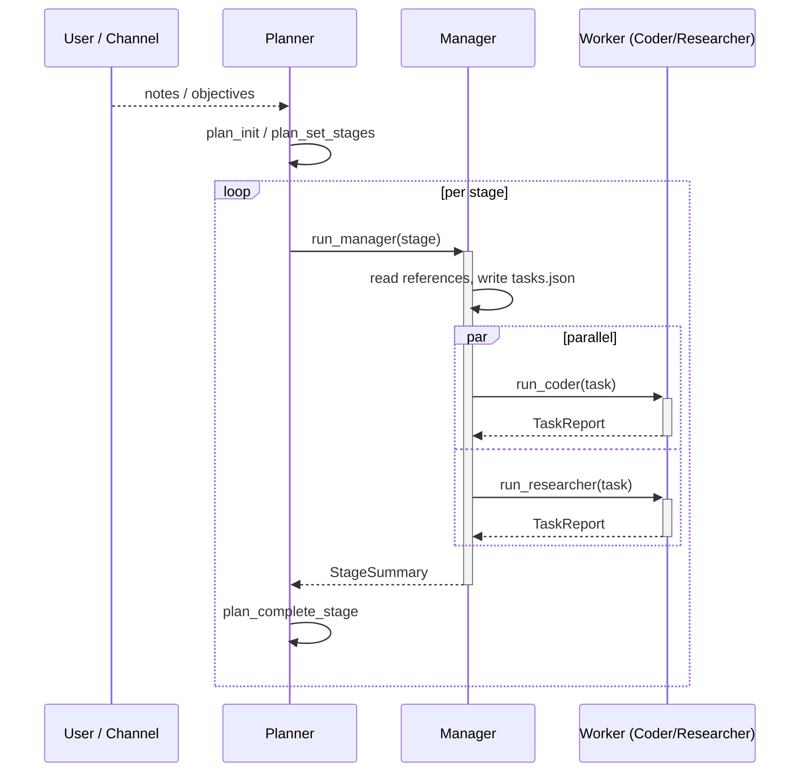

# Agent System

This page is the implementation-side companion to [`SPEC/v2/00-AGENT-SYSTEM.md`](https://github.com/salva/saivage/blob/main/SPEC/v2/00-AGENT-SYSTEM.md).
For each role we cover: source files, lifecycle, inputs/outputs, tools, and
quirks observed during implementation.

## Common base

All agents extend `BaseAgent` ([`src/agents/base.ts`](https://github.com/salva/saivage/blob/main/src/agents/base.ts)),
which owns the conversation loop:

```ts
abstract class BaseAgent<Input, Output> {
  protected role: AgentRole;
  protected systemPrompt: string;
  protected tools: ToolSchema[];

  async run(ctx: AgentContext, input: Input): Promise<AgentResult<Output>>;
  protected abstract assembleSystemPrompt(ctx, input): string;
  protected abstract assembleTools(ctx, input): ToolSchema[];
  protected abstract parseResult(messages: Message[]): Output;
}
```

The `run` method:

1. Resolves model + skills + system prompt.
2. Initializes a `Dispatcher` with this agent's available tools and the
   parent `ChildSpawner`.
3. Loops: `chat()` → execute tool calls → append results → repeat until
   the model emits a terminal response (no tool calls, or a `final` call).
4. Tracks token usage; triggers compaction at the configured threshold.
5. Periodically injects self-check prompts.
6. Returns `AgentResult<Output>` with the parsed terminal output and any
   intermediate artifacts.

## Role table

| Role | Source | Lifetime | Returns |
|------|--------|----------|---------|
| Planner | `agents/planner.ts` | Project lifetime | `RunPlanResult` |
| Manager | `agents/manager.ts` | One stage | `StageSummary` |
| Coder | `agents/coder.ts` | One task | `TaskReport` |
| Researcher | `agents/researcher.ts` | One task | `TaskReport` |
| Inspector | `agents/inspector.ts` | One request | `InspectionReport` |
| Chat | `agents/chat.ts` | Per channel | (streaming events) |
| Reviewer | `agents/reviewer.ts` | Per task (advisory) | `TaskReport` |
| Data Agent | `agents/data-agent.ts` | Per task | `TaskReport` |

The Reviewer and Data Agent roles exist for forward-compat with planned
spec extensions; they are wired through the dispatcher and routing system
and may be invoked by the Manager when configured.

## Hand-off contracts



See per-role pages for the details:

- [Planner](./agent-planner)
- [Manager](./agent-manager)
- [Coder & Researcher](./agent-workers)
- [Inspector](./agent-inspector)
- [Chat](./agent-chat)

## Tool grammar

Every agent has a fixed catalog:

- **MCP tools** — drawn from the runtime registry (filesystem, shell, git,
  plan, notes, skills, web, …). See [MCP services](./mcp-services).
- **Dispatch tools** — `run_manager`, `run_coder`, `run_researcher`,
  `run_inspector`, etc. Recognized by the Dispatcher and converted into
  child-agent invocations. See `DISPATCH_TOOLS` in
  `src/runtime/dispatcher.ts`.
- **`final`** (some roles) — a marker tool the agent calls to commit the
  parsed terminal result.

Each role advertises a subset chosen in `assembleTools()`. The Coder, for
instance, sees the full filesystem/shell/git toolset; the Chat agent gets
read-only filesystem + `run_inspector` + `create_note`.
