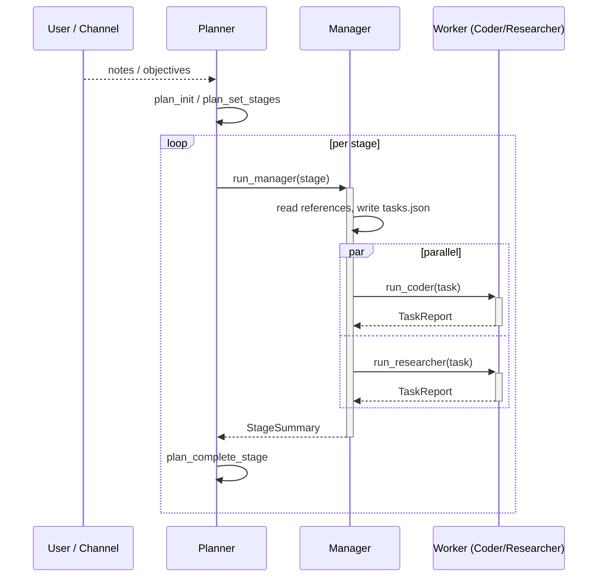

# Agent System

The agent system is a structured hierarchical protocol where each role has a
clearly defined purpose, communicates through tool calls and JSON documents on
disk, and escalates errors upward through a chain of command. This page covers
the overall protocol, lifecycles, and dispatch graph. Per-role details live in
the sibling pages.

Source files: [`src/agents/`](https://github.com/salva/saivage/tree/main/src/agents).
The canonical role registry is `src/agents/roster.ts`.

## 1. Design philosophy

Inter-agent communication uses two complementary mechanisms:

- **Tool-call invocation** for control flow — parent calls child, suspends, child
  returns result.
- **JSON documents on disk** for persistence and auditability — a parent writes
  the task spec to disk, invokes the child via tool call, the child reads the
  spec from disk, does its work, writes results to disk, and returns a summary
  as the tool-call result.

There are no in-memory message queues. This makes the system crash-recoverable,
inspectable, and decoupled.

All project documentation, agent state, runtime config, and auth state live
**inside the project directory** (e.g. `<project>/.saivage/`). Nothing is stored
in a global `~/.saivage/`.

Files are separated into two categories:

- **Persistent** (committed to git): plans, history, research, skills, stage
  summaries, inspection reports.
- **Temporary** (gitignored): runtime state, agent working directories,
  in-progress task data, chat logs.

## 2. Common base

All agents extend `BaseAgent`
([`src/agents/base.ts`](https://github.com/salva/saivage/blob/main/src/agents/base.ts))
which owns the conversation loop:

```ts
abstract class BaseAgent<Input, Output> {
  protected role: AgentRole;
  protected systemPrompt: string;
  protected tools: ToolSchema[];

  async run(ctx: AgentContext, input: Input): Promise<AgentResult<Output>>;
  protected abstract assembleSystemPrompt(ctx, input): string;
  protected abstract assembleTools(ctx, input): ToolSchema[];
  protected abstract parseResult(messages: Message[]): Output;
}
```

The `run` method:

1. Resolves model + skills + system prompt.
2. Initializes a `Dispatcher` with this agent's available tools and the parent
   `ChildSpawner`.
3. Loops: `chat()` → execute tool calls → append results → repeat until the
   model emits a terminal response (no tool calls, or a `final` call).
4. Tracks token usage; triggers compaction at the configured threshold.
5. Periodically injects self-check prompts.
6. Returns `AgentResult<Output>` with the parsed terminal output and any
   intermediate artifacts.

## 3. Roster

| Role | Source | Lifetime | Returns | Page |
|------|--------|----------|---------|------|
| Planner | `agents/planner.ts` | Project lifetime | `RunPlanResult` | [planner](./planner) |
| Manager | `agents/manager.ts` | One stage | `StageSummary` | [manager](./manager) |
| Coder | `agents/coder.ts` | One task | `TaskReport` | [workers](./workers) |
| Researcher | `agents/researcher.ts` | One task | `TaskReport` | [workers](./workers) |
| Data Agent | `agents/data-agent.ts` | One task | `TaskReport` | [workers](./workers) |
| Designer | `agents/designer.ts` | Stage-scoped | `TaskReport` | [stage-scoped](./stage-scoped) |
| Critic | `agents/critic.ts` | Stage-scoped | `TaskReport` | [stage-scoped](./stage-scoped) |
| Reviewer | `agents/reviewer.ts` | Stage-scoped | `TaskReport` | [stage-scoped](./stage-scoped) |
| Inspector | `agents/inspector.ts` | One request | `InspectionReport` | [inspector](./inspector) |
| Librarian | `agents/librarian.ts` | One request | markdown report | [librarian](./librarian) |
| Chat | `agents/chat.ts` | Per channel | (streaming events) | [chat](./chat) |

## 4. Tool grammar

Every agent has a fixed catalog of three tool kinds:

- **MCP tools** — drawn from the runtime registry (filesystem, shell, git,
  plan, notes, skills, web, …). See [MCP services](../mcp/services).
- **Dispatch tools** — `run_manager`, `run_coder`, `run_researcher`,
  `run_inspector`, etc. Recognized by the Dispatcher and converted into
  child-agent invocations. See `DISPATCH_TOOLS` in
  [`src/runtime/dispatcher.ts`](https://github.com/salva/saivage/blob/main/src/runtime/dispatcher.ts).
- **`final`** (some roles) — a marker tool the agent calls to commit the
  parsed terminal result.

Each role advertises a subset chosen in `assembleTools()`. The Coder, for
instance, sees the full filesystem/shell/git toolset; the Chat agent gets
read-only filesystem + `run_inspector` + `create_note`.

## 5. Dispatch graph

All inter-agent invocation uses the tool-call pattern. The canonical dispatch
graph is declared in `src/agents/roster.ts` (each entry's `dispatchTool` +
`dispatchableBy`):

```
Planner (long-lived)
  ├── run_manager(stage)          → returns StageSummary
  │     ├── run_coder(task)         → returns TaskReport
  │     ├── run_researcher(task)    → returns TaskReport
  │     ├── run_data_agent(task)    → returns TaskReport
  │     ├── run_designer(task)      → returns TaskReport (stage-scoped session)
  │     ├── run_critic(task)        → returns TaskReport (stage-scoped session)
  │     ├── run_reviewer(task)      → returns TaskReport (stage-scoped session)
  │     └── run_librarian(req)      → returns markdown report
  ├── run_inspector(request)      → returns InspectionReport
  └── run_librarian(req)          → returns markdown report

Chat (independent, per channel)
  └── create_note(content, permanent?, urgent?)  → writes note for Planner
```

User notes arriving while the Planner is suspended are queued and injected as
additional context when the Planner next resumes (this is a runtime mechanism,
not a tool call).

## 6. Hand-off sequence



## 7. Concurrency

The tool-call model naturally serializes the hierarchy — a parent is suspended
while its child runs:

| Agent      | Max instances | Lifetime           | Invoked by                                |
|------------|---------------|--------------------|-------------------------------------------|
| Planner    | 1             | Project lifetime   | Runtime (top-level)                       |
| Manager    | 1             | One stage          | Planner via `run_manager()`               |
| Coder      | 1             | One task           | Manager via `run_coder()`                 |
| Researcher | 1             | One task           | Manager via `run_researcher()`            |
| Data Agent | 1             | One task           | Manager via `run_data_agent()`            |
| Designer   | 1             | Stage-scoped       | Manager via `run_designer()`              |
| Critic     | 1             | Stage-scoped       | Manager via `run_critic()`                |
| Reviewer   | 1             | Stage-scoped       | Manager via `run_reviewer()`              |
| Inspector  | 1             | One investigation  | Planner via `run_inspector()`             |
| Librarian  | 1             | One investigation  | Planner or Manager via `run_librarian()`  |
| Chat       | 1 per channel | Session            | Runtime (independent)                     |

**Stage-scoped workers** (Designer, Critic, Reviewer) keep their conversation
across the Manager's follow-up dispatches within the same stage so each turn
builds on prior reasoning. **One-shot workers** (Coder, Researcher, Data Agent,
Inspector, Librarian) get a fresh instance per dispatch.

**Parallelism:** The Manager can issue multiple worker dispatch tools in the
same turn; `src/runtime/dispatcher.ts` starts them concurrently via
`Promise.all`. Concurrency is gated per role — a second dispatch of the same
role while one is already running is rejected. See
[runtime/details](../runtime/details) §1.3.

**Chat independence:** Chat agents run independently of the Planner hierarchy.
They can read all documents and forward user direction via `create_note()`
without blocking or being blocked by the main execution chain.

**Inspector contention:** Only the Planner dispatches the Inspector; one
investigation runs at a time.

## 8. Error escalation chain

```
Coder/Researcher (task failure)
       → Manager (retry / remediate / replan tasks)
              → Planner (replan stage / adjust plan)
                     → User (notification via Chat)
```

Every agent can signal that it cannot fulfill a requirement. The signal
propagates upward until an agent handles it or the user is notified.

## 9. Document flow

```
User ←→ Chat ──notes──→ Planner
                           │
                     plan/stages
                           │
                           ▼
                        Manager
                        │     │
                   tasks/      tasks/
                   reports     reports
                      │            │
                      ▼            ▼
                    Coder      Researcher
```

```
Planner ──request──→ Inspector ──report──→ Planner
Chat    ──request──→ Inspector ──report──→ Chat
```

## 10. File system layout

Project-local (inside the project directory, e.g. `<project>/`):

```
<project>/
├── research/                      # Researcher's knowledge base (project-level)
│   └── <topic>/
│
└── .saivage/
    ├── config.json                # Project objectives, model preferences
    ├── saivage.json               # Runtime/provider config
    ├── auth/                      # Provider auth tokens
    │
    │── [PERSISTENT — committed to git]
    ├── plan.json                  # Active plan plus terminal stages archive
    ├── notes/                     # User notes from Chat → Planner
    │   └── <note-id>.json         #   (volatile or permanent)
    ├── stages/
    │   └── <stage-id>/
    │       ├── tasks.json         # Task breakdown for this stage
    │       ├── summary.json       # Stage completion summary
    │       └── reports/
    │           └── <task-id>.json # Individual task reports
    ├── inspections/
    │   └── <report-id>.json       # Inspector reports
    ├── skills/                    # Project-scoped skill records (committed)
    ├── memory/                    # Memory records by scope
    ├── rag/                       # RAG sidecar SQLite store (gitignored)
    ├── tools/
    │   └── inspector/             # Inspector's persistent analysis tools
    │
    │── [TEMPORARY — gitignored]
    ├── tmp/
    │   ├── state/
    │   │   └── runtime.json       # Runtime state for crash recovery
    │   ├── inspector-workspace/   # Inspector's private working dir
    │   ├── chats/
    │   │   └── <channel>/
    │   │       └── <session-id>.json
    │   └── work/
    │       ├── coder/             # Coder's scratch space
    │       └── researcher/        # Researcher's scratch space
    └── .gitignore                 # Ignores tmp/
```

See also: [data/on-disk-layout](../data/on-disk-layout) for the full layout
including knowledge/rag paths.

## 11. Version control

All git operations go through an **MCP git server** that serializes access. No
direct `git` CLI calls by agents. Tools: `git_commit`, `git_status`, `git_diff`,
`git_log`. See [mcp/services](../mcp/services) §3 for full tool schemas.

**Conflict resolution:** If `git_commit` detects a conflict (rare — two agents
modifying the same file), it returns an error. The calling agent reports this
in its `TaskReport` as a failure, which the Manager handles by creating a
resolution task.

**Conventions** (all agents except Chat have full access — conventions prevent
collisions):

- **Coder**: commits project code it modified + its task report.
- **Researcher**: commits files under `research/` + its task report.
- **Inspector**: commits reports under `inspections/` and persistent tools under
  `tools/inspector/`.
- **Planner/Manager**: commit `.saivage/` state files (plan files committed via
  `plan_commit()`, tasks/summaries via git MCP).
- **Chat**: read-only access to project state. Writes only notes and chat logs.

## 12. Plan service

All read and write operations on `plan.json` go through the
[Plan MCP service](../mcp/plan-service). No agent reads or writes this file
directly. All writes are atomic (write to `.tmp`, rename). Schema validation is
enforced on every write.

## 13. Related runtime mechanics

See [runtime/details](../runtime/details) for the full runtime mechanics:
suspend/resume, LLM error handling, compaction timing, self-check injection,
task report flow, crash recovery, abort/replanning, and notification delivery.
Subsystem pages:

- [runtime/dispatcher](../runtime/dispatcher) — suspend/resume + tool dispatch.
- [runtime/compaction](../runtime/compaction) — context compaction.
- [runtime/self-check](../runtime/self-check) — periodic self-check injection.
- [runtime/abort-recovery](../runtime/abort-recovery) — urgent-note abort
  semantics + rollback stages.
- [runtime/supervisor](../runtime/supervisor) — shutdown handoff.
- [runtime/events](../runtime/events) — event bus for channels.
