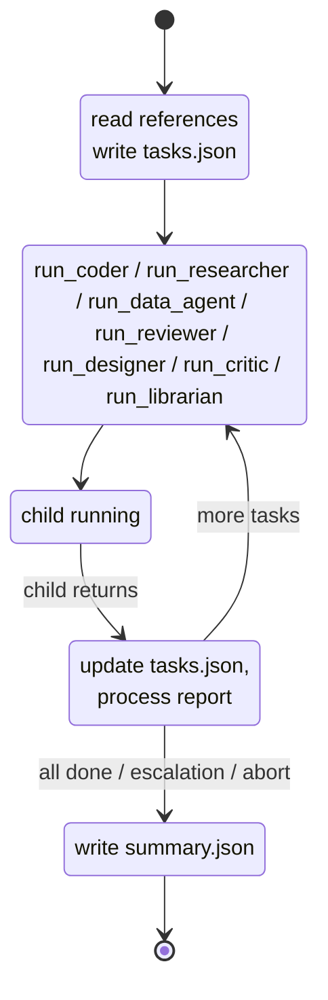

# Manager

[`src/agents/manager.ts`](https://github.com/salva/saivage/blob/main/src/agents/manager.ts),
[`prompts/manager.md`](https://github.com/salva/saivage/blob/main/prompts/manager.md)

A new Manager is spawned for each stage. It owns the stage's task list and
worker dispatch loop.

## Purpose

Tactical task decomposition and execution supervision.

## Lifecycle

The Manager is a **long-lived agent, one per stage**. A fresh Manager instance
is spawned when a new stage begins and persists for the entire stage duration.
It terminates when the stage completes or is escalated to the Planner. The
Manager does not carry state across stages — each new stage gets a fresh
instance with context assembled from the stage description and referenced
documents.

## Inputs

- Current stage description (from Planner's active plan) — must be
  self-contained with references to any documents the Manager should read
  before planning tasks.
- `references[]` documents (read via filesystem MCP at the start of the
  conversation).
- Task completion/failure reports (from Coder, Researcher, Data Agent,
  Designer, Critic, Reviewer) — returned as tool-call results when subagents
  complete.
- Librarian markdown reports — returned from `run_librarian()` when the
  Manager routes a RAG retrieval gap.

## Outputs

- **Task list** (`stages/<stage-id>/tasks.json`) — ordered list of tasks for
  the current stage. Each task has:
  - `id` — unique task identifier
  - `type` — `code` | `research` | `data` | `review` | `test` |
    `document` | `design` | `critique`
  - `assigned_to` — `coder` | `researcher` | `data_agent` | `reviewer` |
    `designer` | `critic`
  - `description` — detailed description of what to do
  - `checklist` — list of verification points the agent must check
  - `dependencies` — tasks that must complete first
  - `status` — `pending` | `in-progress` | `completed` | `failed` | `aborted`
  - `tags` — optional tags for skill matching
  - `started_at` / `completed_at` — optional timestamps
  - `attempt` / `max_attempts` — default to 1 / 3 when omitted
- **Stage summary** (`stages/<stage-id>/summary.json`) — written when all
  tasks complete (or on escalation/abort). Aggregates task summaries. Sent to
  Planner.
- **Task reports** (`stages/<stage-id>/reports/<task-id>.json`) — one per
  worker dispatch, written by the worker.

## Execution model

1. **Planning phase** — reads referenced documents, decomposes the stage into
   tasks (writes `tasks.json`).
2. **Dispatch phase** — calls subagents (Coder/Researcher/Data Agent/Designer/
  Critic/Reviewer/Librarian) via tool calls. The Manager invokes subagents as
  tools; each child runs to completion and returns a `TaskReport` or, for the
  Librarian, a markdown report.
3. **Evaluation phase** — processes the report, updates task status, decides
   next action.
4. **Loop** — returns to dispatch phase for the next ready task(s).
  Independent tasks of distinct worker roles can be dispatched in parallel.
5. **Idle waiting** — when subagents are running, the Manager's LLM
   conversation is **suspended**. On subagent completion, the Manager is
   **resumed** with the report injected as a tool result.

This means the Manager maintains its full conversation context throughout the
stage — it remembers its planning rationale, can adapt task sequencing based
on earlier results, and can generate remediation tasks without re-reading
everything.

## Parallelism

The Manager may issue one dispatch per worker role in a single LLM response.
The Dispatcher starts allowed children concurrently with `Promise.all` and
returns the batch of tool results after the allowed children finish. Issuing
two worker dispatches of the same role in one turn is rejected with an error
tool result. `run_librarian()` is a non-worker dispatch and is not part of that
duplicate-worker gate.

## Behaviors

- **Reads referenced documents** listed in the stage description before
  decomposing tasks.
- Breaks the current stage into concrete tasks ordered by dependency, with
  verification and documentation tasks or checklist items when the stage calls
  for them.
- Dispatches tasks to workers via tool calls.
- Can dispatch **independent tasks in parallel** when they use distinct worker
  roles and have no dependencies.
- Processes task reports returned as tool results.
- On task failure: decides whether to retry, create a remediation task, adjust
  remaining tasks, or escalate to Planner. **Escalation terminates the
  Manager.** On escalation, the Manager updates `tasks.json` — completed
  tasks stay `completed`, the failing task stays `failed`, and remaining
  undispatched tasks stay `pending`.
- On stage completion: writes the stage summary (aggregating Coder/Researcher
  reports) and notifies the Planner. **Then terminates.**
- Routes RAG retrieval gaps to the Librarian when worker reports include an
  issue whose description starts with `rag retrieval miss:`.

## Failure handling

For each failed `TaskReport` or failed required checklist item, the Manager
prompt instructs the LLM to read `failure_reason`, `issues_found[]`, and
`checklist_results[]`, then either fix the issue directly, retry with materially
improved instructions, or escalate when the root cause is outside Manager
scope. `TaskSchema.attempt` defaults to 1 and `max_attempts` defaults to 3, but
the runtime does not automatically increment attempts or cascade dependency
failures; those updates are part of the Manager-authored task list.

## Termination contracts

| Outcome | `StageSummary.result` | Manager terminates? |
|---------|----------------------|---------------------|
| All tasks completed | `completed` | yes |
| Escalation to Planner | `escalated` | yes |
| Aborted (urgent note) | `aborted` | yes |
| Fatal (e.g. context exhausted after max compactions) | `failed` | yes |

On the normal LLM path, the prompt requires the Manager to write `tasks.json`
and `summary.json` before returning the final `StageSummary`. If the agent is
aborted or fails before final output, `manager.ts` returns a partial
`StageSummary` in the `AgentResult` rather than writing those files itself.

## Tools advertised

- **Dispatch:** `run_coder`, `run_researcher`, `run_data_agent`,
  `run_designer`, `run_critic`, `run_reviewer`, `run_librarian`.
- **Filesystem** (read/write under `.saivage/stages/<id>/`).
- **Git** (`git_status`, `git_log`, `git_diff`, `git_commit`, etc.).
- **Shell/data/web/RAG/knowledge tools** that pass the worker tool filter and
  service-level ACLs. The worker filter excludes Plan MCP tools plus
  `create_skill` and `update_skill`.

The Manager **does not** modify the active plan; that is the Planner's job.

## Trigger events

- New stage assigned by Planner → Manager spawned.
- Subagent tool call returns → Manager LLM conversation resumed.
