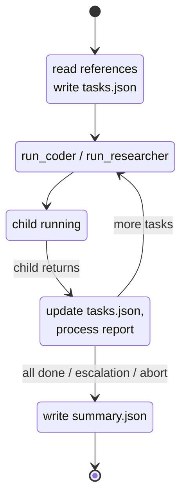

# Manager

[`src/agents/manager.ts`](https://github.com/salva/saivage/blob/main/src/agents/manager.ts)

A new Manager is spawned for each stage. It owns the stage's task list and
worker dispatch loop.

## Purpose

Tactical task decomposition and execution supervision.

## Lifecycle

The Manager is a **long-lived agent, one per stage**. A fresh Manager instance
is spawned when a new stage begins and persists for the entire stage duration.
It terminates when the stage completes or is escalated to the Planner. The
Manager does not carry state across stages — each new stage gets a fresh
instance with context assembled from the stage description and referenced
documents.

## Inputs

- Current stage description (from Planner's active plan) — must be
  self-contained with references to any documents the Manager should read
  before planning tasks.
- `references[]` documents (read via filesystem MCP at the start of the
  conversation).
- Task completion reports (from Coder/Researcher) — returned as tool-call
  results when subagents complete.
- Task failure reports (from Coder/Researcher) — returned as tool-call results
  with `status: "failed"`.

## Outputs

- **Task list** (`stages/<stage-id>/tasks.json`) — ordered list of tasks for
  the current stage. Each task has:
  - `id` — unique task identifier
  - `type` — `code` | `research` | `test` | `document`
  - `assigned_to` — `coder` | `researcher`
  - `description` — detailed description of what to do
  - `checklist` — list of verification points the agent must check
  - `dependencies` — tasks that must complete first
  - `status` — `pending` | `in-progress` | `completed` | `failed` | `aborted`
- **Stage summary** (`stages/<stage-id>/summary.json`) — written when all
  tasks complete (or on escalation/abort). Aggregates task summaries. Sent to
  Planner.
- **Task reports** (`stages/<stage-id>/reports/<task-id>.json`) — one per
  worker dispatch, written by the worker.

## Execution model

1. **Planning phase** — reads referenced documents, decomposes the stage into
   tasks (writes `tasks.json`).
2. **Dispatch phase** — calls subagents (Coder/Researcher/Data Agent/Designer/
   Critic/Reviewer) via tool calls. The Manager invokes subagents as tools —
   each tool call blocks until the subagent completes and returns its
   `TaskReport`.
3. **Evaluation phase** — processes the report, updates task status, decides
   next action.
4. **Loop** — returns to dispatch phase for the next ready task(s).
   Independent tasks (1 Coder + 1 Researcher) can be dispatched in parallel.
5. **Idle waiting** — when subagents are running, the Manager's LLM
   conversation is **suspended**. On subagent completion, the Manager is
   **resumed** with the report injected as a tool result.

This means the Manager maintains its full conversation context throughout the
stage — it remembers its planning rationale, can adapt task sequencing based
on earlier results, and can generate remediation tasks without re-reading
everything.

## Parallelism

The Manager may issue **one Coder + one Researcher** (and analogous
combinations of distinct roles) in a single LLM response. The Dispatcher
detects this and spawns both children concurrently, resuming the Manager as
each child returns (*resume-on-each*). Issuing two of the same role in one
turn is rejected with an error tool result.

## Behaviors

- **Reads referenced documents** listed in the stage description before
  decomposing tasks.
- Breaks the current stage into tasks, including mandatory best-practice tasks:
  - Testing for code changes
  - Documentation for new features/APIs

  These can be standalone tasks or checklist items within coding tasks.
- Dispatches tasks to workers via tool calls.
- Can dispatch **independent tasks in parallel** (1 Coder + 1 Researcher) when
  they have no dependencies.
- Processes task reports returned as tool results.
- On task failure: decides whether to retry, create a remediation task, adjust
  remaining tasks, or escalate to Planner. **Escalation terminates the
  Manager.** On escalation, the Manager updates `tasks.json` — completed
  tasks stay `completed`, the failing task stays `failed`, and remaining
  undispatched tasks stay `pending`.
- On stage completion: writes the stage summary (aggregating Coder/Researcher
  reports) and notifies the Planner. **Then terminates.**
- **Authors skills directly** via the `create_skill` / `update_skill` /
  `supersede_skill` MCP tools when a tool or pattern is established that will
  be reused. The Manager writes the skill record itself; it does **not**
  dispatch a Coder to do this. Skill authorship is restricted to Manager and
  Inspector (see [mcp/services](../mcp/services) §6).
- May also call `create_memory` (and the memory lifecycle tools) directly to
  record durable project-scope facts; see
  [`src/knowledge/permissions.ts`](https://github.com/salva/saivage/blob/main/src/knowledge/permissions.ts)
  for the per-role matrix.

## Failure handling

For each `TaskReport` with `status: "failed"`:

1. Increment `task.attempt`.
2. Append failure context to the description.
3. If `attempt < max_attempts` → retry.
4. Otherwise → escalate to the Planner. Escalation terminates the Manager.
5. If a *dependency* task failed, the Manager cascades failure to all
   dependents (without dispatching them).

`max_attempts` defaults to 3 and can be overridden in the system prompt (via
skills) or in stage description metadata.

## Termination contracts

| Outcome | `summary.json.result` | Manager terminates? |
|---------|----------------------|---------------------|
| All tasks completed | `completed` | yes |
| Escalation to Planner | `escalated` | yes |
| Aborted (urgent note) | `aborted` | yes |
| Fatal (e.g. context exhausted after max compactions) | `failed` | yes |

In all cases the Manager writes `summary.json` and `tasks.json` first so the
on-disk state is consistent before resume.

## Tools advertised

- **Dispatch:** `run_coder`, `run_researcher`, `run_data_agent`,
  `run_designer`, `run_critic`, `run_reviewer`, `run_librarian`.
- **Filesystem** (read/write under `.saivage/stages/<id>/`).
- **Git** (`git_status`, `git_log` — diagnostic only; commits are done by
  workers).
- **Plan MCP** (read-only — `plan_get`, `plan_get_stage`).
- **Skills/memory** — `create_skill`, `update_skill`, `supersede_skill`,
  `create_memory`, etc.

The Manager **does not** modify the active plan; that is the Planner's job.

## Trigger events

- New stage assigned by Planner → Manager spawned.
- Subagent tool call returns → Manager LLM conversation resumed.
