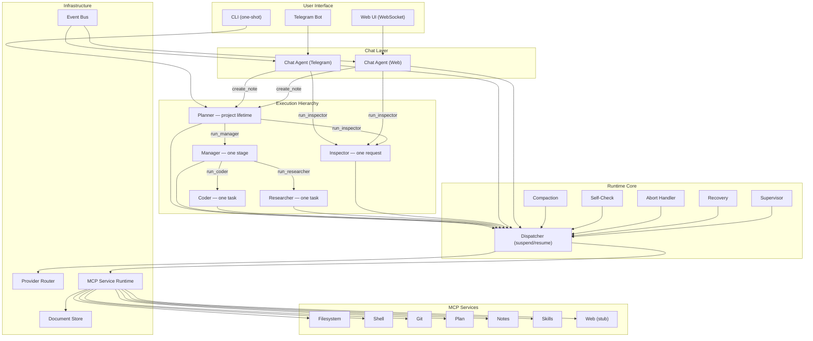

# Architecture

This page is the entry point for understanding Saivage's internals. It maps
the high-level diagram to the source tree and links to the detailed
sub-pages.

## High-level picture

## Module map

| Concern | Source root | Highlights |
|---------|-------------|------------|
| Type definitions / Zod schemas | [`src/types.ts`](https://github.com/salva/saivage/blob/main/src/types.ts) | Source of truth for every persisted JSON document. |
| Project config & paths | [`src/store/project.ts`](https://github.com/salva/saivage/blob/main/src/store/project.ts) | `discoverProject`, `loadProject`, `initProject`. |
| Daemon config | [`src/config.ts`](https://github.com/salva/saivage/blob/main/src/config.ts) | `SaivageConfig`, env interpolation, defaults. |
| Document store | [`src/store/documents.ts`](https://github.com/salva/saivage/blob/main/src/store/documents.ts) | Atomic JSON read/write with Zod parsing. |
| Agents | `src/agents/` | One file per role + `base.ts` orchestrator. |
| Runtime core | `src/runtime/` | dispatcher, compaction, self-check, abort, recovery, supervisor, notes, stash, shutdown handoff. |
| Provider router | `src/providers/` | LLM API multiplexing, retry, failover. |
| MCP runtime | `src/mcp/` | In-process services + external server bridge. |
| Auth | `src/auth/` | OAuth flows + token store. |
| Routing | `src/routing/resolver.ts` | Project-level routing rules + profiles. |
| Channels | `src/channels/` | CLI, websocket, telegram, oneshot. |
| Server | `src/server/` | `bootstrap`, `server`, `cli`, `telegram-bot`. |
| Skills | `src/skills/loader.ts` | Trigger matching + prompt assembly. |
| Security | `src/security/secrets.ts` | Secret environment-variable scrubbing. |
| Events | `src/events/bus.ts` | Pub/sub for `SystemEvent`s. |

## Core invariants

1. **Disk is the source of truth.** Every recoverable piece of state is a
   JSON file under `.saivage/`. LLM conversations are working memory and
   never durably persisted (the `chats/` directory is informational only).
2. **Communication via tool calls.** No message queues. A parent invokes
   a child as an LLM tool call; the child's `AgentResult` is returned as the
   tool result. This is implemented by the [Dispatcher](./dispatcher).
3. **Conventions, not enforcement.** All agents have full filesystem and
   shell access; they self-restrict. The benefit is fewer permission rabbit
   holes; the cost is that you must run inside a sandbox.
4. **One Coder + one Researcher in flight per Manager.** Enforced by the
   Dispatcher.
5. **Single Inspector at a time.** FIFO queueing.
6. **Volatile vs. permanent state.** Anything under
   `.saivage/tmp/` is recoverable from the durable state above it.

## Lifecycle of a single stage

1. **Planner** picks the next stage, calls `run_manager(stage)`.
2. Dispatcher suspends the Planner conversation, spawns a Manager.
3. **Manager** reads `references[]` documents, decomposes into tasks,
   writes `tasks.json`, dispatches a Coder and (optionally) a Researcher in
   parallel.
4. Workers do their job, commit via the git MCP tool, and return a
   `TaskReport`.
5. Manager resumes per worker return, updates `tasks.json`, may dispatch
   the next task or remediate failures.
6. When all tasks are done (or escalated), the Manager writes
   `summary.json`, returns a `StageSummary`, and terminates.
7. Planner resumes, calls `plan_complete_stage()`, picks the next stage.

## Where to read next

- [Source tree](./source-tree) for a directory-level walk.
- [Agent system](./agents) for a deep dive on every role.
- [Dispatcher & Suspend/Resume](./dispatcher) for the runtime mechanics.
- [Specifications](./specifications) for the original design documents.
