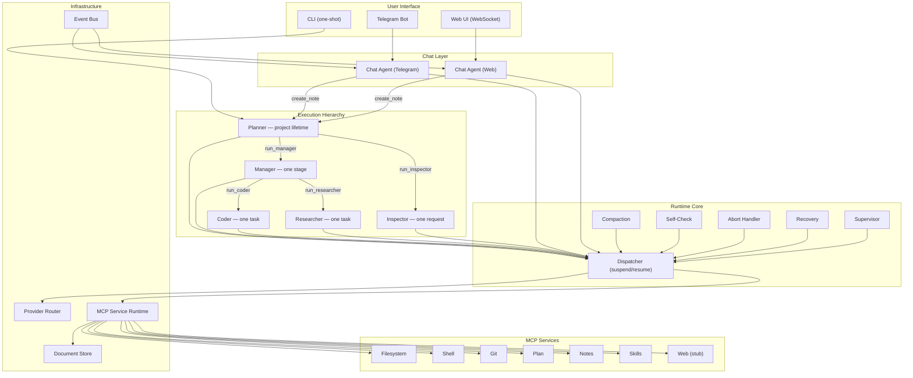
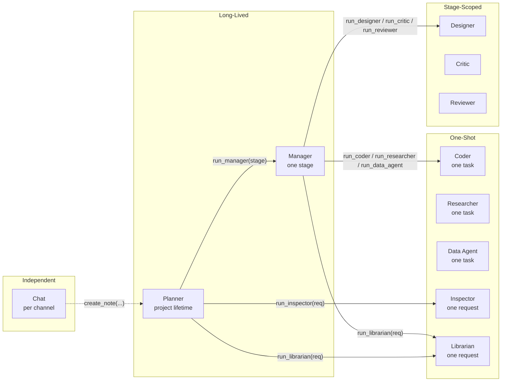
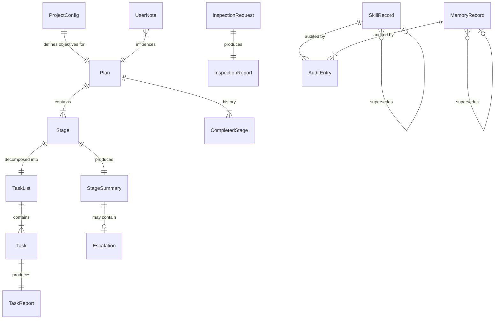
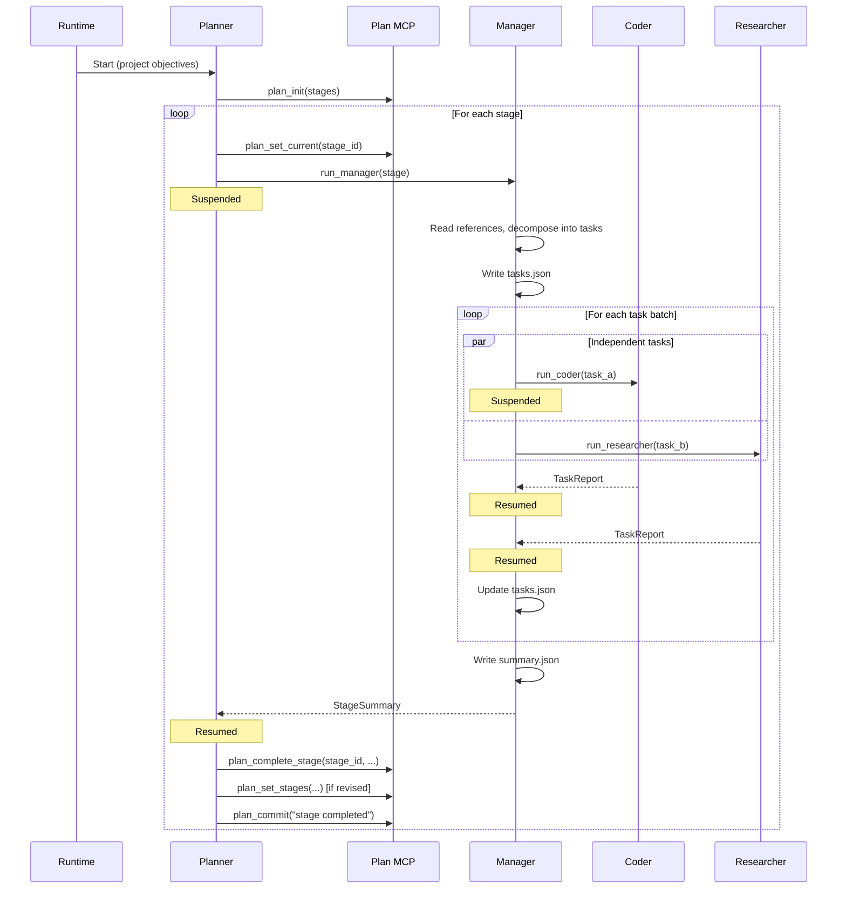
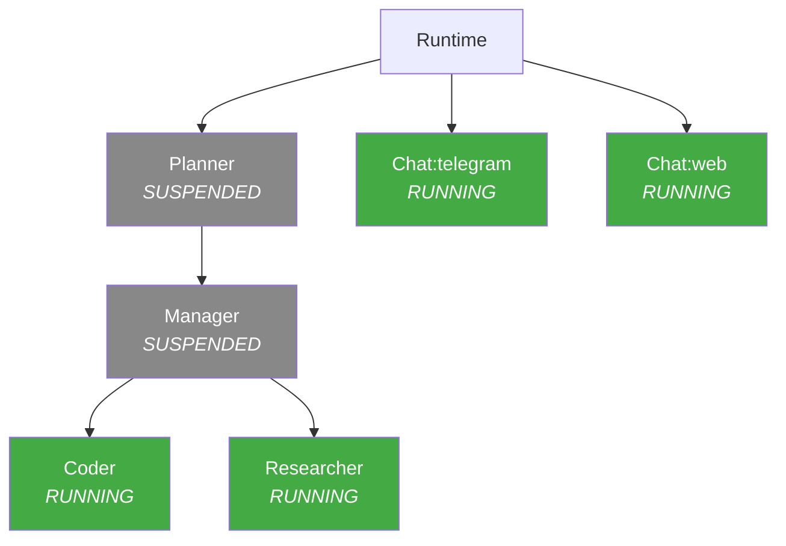
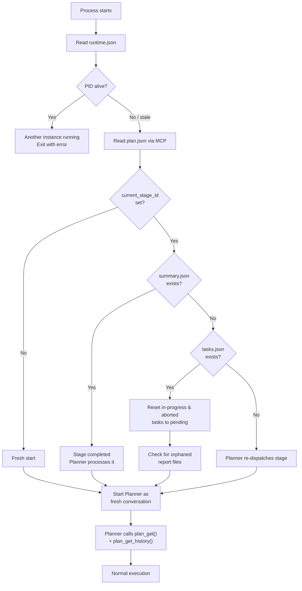
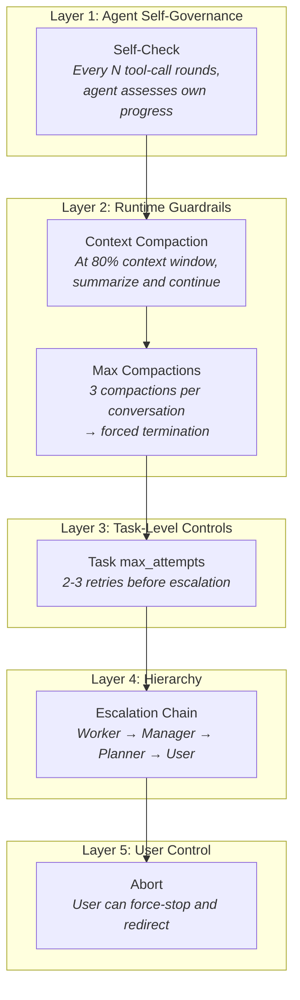

# Architecture

Comprehensive architecture reference for the Saivage system. This page is the
primary entry point for understanding internals; the linked sub-pages cover
each subsystem in depth.

## 1. System overview

Saivage is an **autonomous software engineering system** that takes high-level
project objectives and executes them through a hierarchy of specialized LLM
agents. It manages its own planning, task decomposition, code generation,
research, quality assurance, and user communication — running continuously
until the objectives are met or the user redirects.

### 1.1 Design principles

- **Hierarchical delegation:** a chain of command (Planner → Manager → Workers)
  where each level has well-scoped responsibility and clear contracts.
- **Disk is the source of truth:** all durable state lives on disk as JSON
  documents. LLM conversations are transient working memory — losing them is
  always recoverable.
- **Tool-call invocation:** agents communicate exclusively through LLM tool
  calls. A parent calls a child as a tool, suspends, receives the result when
  the child finishes. No message queues, no shared memory.
- **Role-scoped tools plus conventions:** each role receives only the tools
  exposed by its tool filter, while territorial conventions still guide where
  mutable roles write (Coder writes project code, Researcher writes under
  `research/`, Librarian writes RAG memories).
- **Crash recoverability:** the system can restart at any point and
  reconstruct its state from disk.
- **Progressive escalation:** failures cascade upward (Worker → Manager →
  Planner → User) with each level having the opportunity to retry,
  remediate, or replan.

### 1.2 High-level diagram



## 2. Core components

### 2.1 Runtime Core

The Runtime Core is the central orchestration engine. It is a **singleton**
within the Node.js process and manages the lifecycle of every agent
conversation.

**Responsibilities:**

- **Agent lifecycle management:** spawn, suspend, resume, and terminate agent
  LLM conversations.
- **Tool-call dispatch:** intercept agent-dispatch tool calls (`run_manager`,
  `run_coder`, etc.), suspend the parent, spawn the child, and inject the
  child's result back into the parent's conversation when done.
- **Abort handling:** detect urgent user notes, terminate the active agent
  chain bottom-up, clean the working tree (`git checkout -- .` resets tracked
  modified files; untracked files are left for the rollback stage), and
  resume the Planner with the abort context.
- **Context compaction:** track token usage per conversation, trigger
  compaction when usage exceeds the threshold (default 80%), produce a summary
  message that replaces the conversation history.
- **Periodic self-check:** inject a progress-assessment prompt after every N
  tool-call rounds to catch infinite loops.
- **Crash recovery:** on startup, detect stale state from a previous crash,
  reconstruct the execution position from disk, and restart the Planner.

**Key technical details:**

- Runs on the **Node.js single-threaded event loop**. Concurrency is achieved
  through async I/O — LLM calls, MCP tool calls, and channel messages are all
  non-blocking.
- Parent agents are suspended in-memory (full message history + pending
  tool-call IDs). On crash, this is lost, but disk state is authoritative.
- The Dispatcher supports **resume-on-each** for parallel child dispatch: when
  the Manager issues multiple worker dispatches in one LLM response, children
  run concurrently and the Manager resumes independently as each returns. The
  runtime permits at most one dispatch per worker role in a single batch
  (Coder, Researcher, Data Agent, Reviewer, Designer, Critic); duplicate
  dispatch calls for the same worker role are rejected with an error result.

See [runtime/details](./runtime/details) for full suspend/resume mechanics,
compaction timing, self-check injection, and failure handling.

### 2.2 Agent system

Eleven specialized agents, each an LLM conversation with a system prompt, a
set of available tools, and a well-defined contract for inputs and outputs.
The canonical roster is `src/agents/roster.ts`.



Full role catalog (purpose, lifecycle, inputs, outputs, tools, behaviors) in
[agents/](./agents/).

### 2.3 LLM Provider Router

The Provider Router manages all LLM API communication. It is a **singleton**.

**Responsibilities:**

- **Model selection:** for each agent role, select the model from
  configuration. Precedence: `ProjectConfig.model_overrides[role]` →
  `SaivageConfig.providers[name].models[role]` → most capable available.
- **Candidate health and failover:** retryable provider errors (HTTP 429,
  5xx, timeouts, provider-specific transient codes) mark the current
  provider/model/account candidate unhealthy and the router moves to the next
  healthy candidate in the equivalent-model and failover chain.
- **Agent-level backoff:** when all candidates fail transiently, `BaseAgent`
  backs off at 30s ×1.5 capped at 20 min. Throttling retries do not count
  against the non-throttling retry cap; non-throttling transient failures
  surface after 500 attempts.
- **Primary retry window:** when a fallback succeeds after the primary was
  attempted, the router sticks to that fallback until the primary retry window
  opens again (30s ×1.5, capped at 20 min).
- **Request timeout:** each provider call is bounded by
  `PROVIDER_REQUEST_TIMEOUT_MS`, currently 300s; there is no per-provider
  timeout override.

**Non-retryable errors** (surfaced as agent failure): HTTP 400 (bad request),
HTTP 401/403 (auth failure), context window exceeded.

The full `SaivageConfig` shape — including `security`, `supervisor`,
`mcpServers`, and `runtime.continuousImprovement` — lives in
[`src/config.ts`](https://github.com/salva/saivage/blob/main/src/config.ts)
and is referenced by [data/types](./data/types) §1.

See [providers/router](./providers/router) and
[runtime/details](./runtime/details) §2 for retry details and invalid
tool-call handling.

### 2.4 MCP service runtime

The MCP Service Runtime manages the service registry: in-process built-ins and
configured external MCP server processes.

**Responsibilities:**

- **Bootstrap registration:** built-in services are registered in-process
  during bootstrap. Configured external MCP servers connect during bootstrap
  only when `autostart` is true and the entry is not disabled.
- **Health monitoring:** periodic health checks apply to running external
  services. Dead services are restarted when `restartOnCrash` is enabled.
- **Idle shutdown:** running external services unused for a configurable
  period are stopped to free resources.
- **Crash recovery:** repeated external service startup failures enter a
  cooldown window before later calls can try again.
- **Synthetic dispatch tools:** agent-dispatch tools (`run_manager`,
  `run_coder`, etc.) are generated from the roster and intercepted by the
  Dispatcher; they are not external MCP subprocesses.
- **Tool routing:** `callTool(service, tool, args)` routes to an in-process
  handler or an already-running external client.

**Services available:** filesystem, shell, data, git, skills, memory, plan,
notes, RAG, plus unavailable web/index/lock stubs. External MCP services use
the configured MCP transport; built-ins are in-process. Full tool schemas and
access matrix in [mcp/services](./mcp/services).

### 2.5 Event bus & notification system

An in-process pub/sub bus that connects runtime events to user-facing
channels.

**Responsibilities:**

- **Event publishing:** the runtime publishes events when significant things
  happen (stage completed, task failed, escalation, Inspector report ready,
  plan updated).
- **Chat subscription:** each Chat agent subscribes on startup. When an event
  arrives, the Chat agent checks the user's notification filters
  (min_severity, category whitelist) and formats a concise push message.
- **Channel delivery:** Telegram via bot API `sendMessage`, Web via WebSocket
  push.
- **Offline buffering:** if a channel is disconnected, buffer up to 100
  events. On overflow, drop oldest with a summary message. Deliver buffered
  events on reconnection.

**Event types:**

| Event | Published when | Severity |
|-------|---------------|----------|
| `stage_completed` | Manager returns success | info |
| `stage_failed` | Manager fails unrecoverably (runtime error, not escalation) | error |
| `escalation` | Manager escalates to Planner | warning |
| `task_failed` | Worker returns failure | warning |
| `inspector_complete` | Inspector returns report | info |
| `plan_updated` | Planner modifies the plan | info |

See [runtime/events](./runtime/events) for bus internals.

### 2.6 Skill & memory system

Skill and memory records share one document-store substrate, one Zod base
(`RecordBase`), one append-only audit log, and one permission engine in
`src/knowledge/`. They diverge on default surfacing mode: skills are eagerly
injected into agent system prompts at construction time; memories are
on-demand lookup (or eager when `target_agents` is non-empty).

Full design: [knowledge/skills-and-memory](./knowledge/skills-and-memory).

### 2.7 Document store

A generic CRUD layer for all JSON documents on disk.

**Responsibilities:**

- **Atomic writes:** every write goes to a `.tmp` file first, then is renamed
  into place. No partial writes on crash.
- **Schema validation:** every document is validated against its Zod schema
  before write. Invalid data is rejected.
- **CRUD operations:** `read<T>(path)`, `write<T>(path, data)`,
  `append<T>(path, item)`, `list(dir)`, `delete(path)`.
- **Project context:** bundles project root, config, and resolved paths for
  all downstream components.

See [knowledge/store](./knowledge/store).

## 3. Module map

| Concern | Source root | Highlights |
|---------|-------------|------------|
| Type definitions / Zod schemas | [`src/types.ts`](https://github.com/salva/saivage/blob/main/src/types.ts) | Source of truth for every persisted JSON document. |
| Project config & paths | [`src/store/project.ts`](https://github.com/salva/saivage/blob/main/src/store/project.ts) | `discoverProject`, `loadProject`, `initProject`. |
| Daemon config | [`src/config.ts`](https://github.com/salva/saivage/blob/main/src/config.ts) | `SaivageConfig`, env interpolation, defaults. |
| Document store | [`src/store/documents.ts`](https://github.com/salva/saivage/blob/main/src/store/documents.ts) | Atomic JSON read/write with Zod parsing. |
| Agents | `src/agents/` | One file per role + `base.ts` orchestrator. |
| Runtime core | `src/runtime/` | dispatcher, compaction, self-check, abort, recovery, supervisor, notes, stash, shutdown handoff. |
| Provider router | `src/providers/` | LLM API multiplexing, retry, failover. |
| MCP runtime | `src/mcp/` | In-process services + external server bridge. |
| Auth | `src/auth/` | OAuth flows + token store. |
| Routing | `src/routing/resolver.ts` | Project-level routing rules + profiles. |
| Channels | `src/channels/` | CLI, websocket, telegram, oneshot. |
| Server | `src/server/` | `bootstrap`, `server`, `cli`, `telegram-bot`. |
| Knowledge (skills/memory) | `src/knowledge/` | Sidecar, lifecycle, permissions, eager loader. |
| Security | `src/security/secrets.ts` | Secret environment-variable scrubbing. |
| Events | `src/events/bus.ts` | Pub/sub for `SystemEvent`s. |

## 4. Core invariants

1. **Disk is the source of truth.** Every recoverable piece of state is a JSON
   file under `.saivage/`. LLM conversations are working memory and never
   durably persisted (the `chats/` directory is informational only).
2. **Communication via tool calls.** No message queues. A parent invokes a
   child as an LLM tool call; the child's `AgentResult` is returned as the
   tool result. This is implemented by the [Dispatcher](./runtime/dispatcher).
3. **Tool filters plus conventions.** Role-level tool filters constrain each
  agent's visible tools; convention rules define write territory for roles
  that can mutate files. The benefit is fewer accidental collisions; the cost
  is that filesystem and shell tools still belong in a sandboxed project.
4. **One dispatch per worker role per batch.** Enforced by the Dispatcher.
5. **Single Inspector at a time.** FIFO queueing.
6. **Volatile vs. permanent state.** Anything under `.saivage/tmp/` is
   recoverable from the durable state above it.

## 5. Data architecture

### 5.1 Storage layout

All Saivage state lives inside `<project>/.saivage/`. See
[data/on-disk-layout](./data/on-disk-layout) for the full tree.

### 5.2 Data sovereignty rules

Each data domain has a single owner and a defined access pattern:

| Data | Owner | Written by | Read by | Storage |
|------|-------|-----------|---------|---------|
| `plan.json` | Plan MCP service | Planner (via MCP tools) | Planner, Chat | Git-tracked |
| `stages/<id>/tasks.json` | Manager | Manager | Manager, Planner (via summary) | Git-tracked |
| `stages/<id>/summary.json` | Manager | Manager | Planner | Git-tracked |
| `stages/<id>/reports/<id>.json` | Worker | Coder/Researcher | Manager | Git-tracked |
| `notes/<id>.json` | Chat | Chat (via `create_note`); Runtime (acknowledgment, cleanup) | Planner (via runtime injection) | Git-tracked |
| `inspections/<id>.json` | Inspector | Inspector | Planner, Chat | Git-tracked |
| `research/<topic>/` | Researcher | Researcher | Any agent | Git-tracked |
| `skills/` | Manager / Inspector (via MCP) | Manager / Inspector | All agents (via loader) | Git-tracked |
| `tools/inspector/` | Inspector | Inspector | Inspector | Git-tracked |
| `tmp/state/runtime.json` | Runtime | Runtime Core | Runtime (recovery) | Gitignored |
| `tmp/chats/` | Chat | Chat | Chat | Gitignored |
| Project source code | Coder | Coder | Any agent | Git-tracked |
| Git history | Git MCP | All agents (via MCP) | All agents | Git |

**Key rules:**

- No agent reads or writes `plan.json` directly — all access goes through the
  Plan MCP service.
- No agent calls `git` CLI directly — all git operations go through the Git
  MCP service.
- Conversations are ephemeral. Disk is the source of truth. On crash, all
  conversations are lost and reconstructed from files.

### 5.3 Document relationships



Full TypeScript interfaces for all document types in
[data/types](./data/types).

## 6. Execution model

### 6.1 Main loop

The system runs as a **nested tool-call chain**. The Planner is the top-level
agent; all others are children invoked as tools.



### 6.2 Abort & replanning

When the user sends an urgent note, the runtime aborts the active agent chain
and returns control to the Planner. See
[runtime/abort-recovery](./runtime/abort-recovery) for full semantics.

### 6.3 Error escalation

Failures cascade upward through the hierarchy, with each level having the
opportunity to handle them:

```
Coder/Researcher (task failure)
  → Manager (retry / remediate / replan tasks)
    → Planner (replan stage / adjust plan)
      → User (notification via Chat)
```

### 6.4 Context compaction

Applies to **all agents** when their conversation approaches the context
window limit. **Safety net order:** self-check (N rounds) → compaction (80%
context) → max compactions (3) → forced termination.

See [runtime/compaction](./runtime/compaction).

## 7. MCP services

The system interacts with external resources (filesystem, git, web) and
manages internal state (plan, skills, memory) through **MCP services** —
child processes that expose tools via the MCP SDK stdio protocol.

**Key design decisions:**

- **Git is serialized:** the Git MCP processes one tool call at a time. This
  eliminates race conditions — no locking needed.
- **Plan is atomic:** all plan writes use temp-file + rename. Schema
  validation on every write.
- **Services are lazy:** started on first tool call, shut down after idle
  timeout.

| Service | Planner | Manager | Coder | Researcher | Inspector | Chat |
|---------|:-------:|:-------:|:-----:|:----------:|:---------:|:----:|
| Filesystem (read) | ✓ | ✓ | ✓ | ✓ | ✓ | ✓ |
| Filesystem (write) | — | ✓ | ✓ | ✓ | ✓ | — |
| Shell | — | — | ✓ | ✓ | ✓ | — |
| Git | ✓ | ✓ | ✓ | ✓ | ✓ | — |
| Web | — | — | ✓ | ✓ | ✓ | — |
| Plan (read) | ✓ | — | — | — | — | ✓ |
| Plan (write) | ✓ | — | — | — | — | — |

Skills & memory ACL is enforced at the MCP runtime
(`ToolCallContext` + `permissions.canCall`) per-tool per-role; the matrix is
not summarizable in one row. See [mcp/services](./mcp/services) §§6–7 and
[knowledge/skills-and-memory](./knowledge/skills-and-memory) for the full
roles × operations grid.

Full tool schemas, parameters, and return values in
[mcp/services](./mcp/services). Plan MCP specification in
[mcp/plan-service](./mcp/plan-service).

## 8. Concurrency model

### 8.1 Single-threaded async

Saivage runs on the **Node.js single-threaded event loop**. All concurrency
is cooperative async I/O:

- **LLM API calls:** the main source of async work. While waiting for one
  agent's response, another agent's response can arrive.
- **MCP tool calls:** child process communication via stdio pipes is async.
- **Channel messages:** Telegram polling and WebSocket events are async.

### 8.2 Active agent tree

At any point in time, only **leaf agents** are actively making LLM calls.
Parent agents are suspended in memory.



### 8.3 Race condition prevention

| Shared resource | Protection mechanism |
|----------------|---------------------|
| Git repository | Mutated through explicit Git MCP tools with per-call file scoping |
| `plan.json` | Serialized through Plan MCP (one call at a time) |
| File writes | Atomic temp-file + rename |
| Agent territories | Convention-based (Coder=project code, Researcher=research/) |

The one-worker-per-role batch limit is enforced by the runtime, not just by
convention. If the LLM emits duplicate dispatch calls for the same worker role,
the excess calls are rejected.

## 9. Persistence & recovery

### 9.1 Crash recovery

On process restart, the system reconstructs its position from disk:



### 9.2 What survives a crash

| State | Survives? | How |
|-------|-----------|-----|
| Plan (stages, history) | ✓ | `plan.json` on disk |
| Task list and status | ✓ | `tasks.json` on disk |
| Task reports | ✓ | `reports/<task-id>.json` on disk |
| Stage summaries | ✓ | `summary.json` on disk |
| Inspection reports | ✓ | `inspections/<id>.json` on disk |
| Git commits | ✓ | Git history |
| Uncommitted file changes | ✓ | Working tree (unless aborted) |
| Agent conversations | ✗ | In-memory only. Reconstructed from disk. |
| Event bus state | ✗ | In-memory only. Events re-publish on reconnection. |

## 10. Safety & reliability

### 10.1 Defense in depth

Multiple layers prevent runaway agents, data corruption, and unrecoverable
failures:



### 10.2 Fault tolerance

| Failure | Recovery mechanism |
|---------|-------------------|
| LLM API timeout / 5xx | Candidate failover plus agent-level exponential backoff; non-throttling failures surface after 500 attempts |
| LLM API 400 (bad request) | Agent returns failure to parent |
| LLM provider persistently down | Failover to backup provider |
| Invalid tool call from LLM | Error result returned to LLM (self-corrects); 3 consecutive failures → agent failure |
| MCP service crash | Auto-restart on next tool call |
| Agent infinite loop | Self-check → compaction → max compactions → forced termination |
| Process crash | Disk-based recovery on restart |
| User abort | `git checkout -- .`, rollback stage, replan |
| Git conflict | Agent reports failure; Manager creates resolution task or escalates |

### 10.3 Auditability

Every agent action produces a persistent, git-committed artifact:

- **Planner:** `plan.json` (committed via `plan_commit()`)
- **Manager:** `tasks.json`, `summary.json` (committed via git MCP)
- **Workers:** task reports + git commits with `[tsk-<id>]` prefix
- **Inspector:** `inspections/<id>.json` + tools under `tools/inspector/`
- **Chat:** dialogue logs in `tmp/chats/` (ephemeral but persisted across
  sessions)

The git log provides a complete, append-only timeline of all changes.

## 11. Where to read next

- [Source tree](./source-tree) — directory-level walk.
- [Agent system](./agents/) — every role in depth.
- [Runtime dispatcher](./runtime/dispatcher) — suspend/resume mechanics.
- [Runtime details](./runtime/details) — compaction, self-check, recovery,
  abort.
- [Data types](./data/types) — TypeScript interfaces for every persisted
  document.
- [MCP services](./mcp/services) — the full tool catalog with schemas.
- [Knowledge: skills & memory](./knowledge/skills-and-memory) — eager
  injection, audit, permissions.
