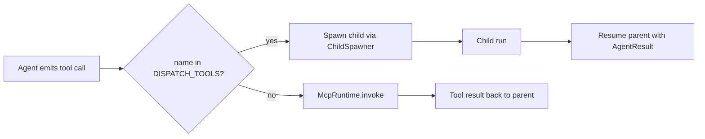

# Dispatcher & Suspend/Resume

[`src/runtime/dispatcher.ts`](https://github.com/salva/saivage/blob/main/src/runtime/dispatcher.ts)
· spec [`SPEC/v2/04-RUNTIME-DETAILS.md`](https://github.com/salva/saivage/blob/main/SPEC/v2/04-RUNTIME-DETAILS.md)

The Dispatcher is the heart of the runtime. It implements the
**suspend / resume / nested-tool-call** pattern that makes the agent
hierarchy possible.

## Dispatch tools

```ts
const DISPATCH_TOOLS = new Set([
  "run_manager",
  "run_coder",
  "run_researcher",
  "run_data_agent",
  "run_reviewer",
  "run_inspector",
]);
```

When the model emits a tool call whose name is in this set, the
Dispatcher does **not** route it to the MCP runtime. Instead it:

1. Suspends the parent agent's conversation (saves `messages`,
   `pendingToolCalls`, `tokenUsage`, `selfCheckState`).
2. Resolves the child role from the tool name.
3. Spawns a fresh `BaseAgent` instance for the child via the
   `ChildSpawner` callback (provided by `bootstrap()`).
4. Awaits the child's `run()`.
5. Resumes the parent: appends the child's `AgentResult` as a tool result
   message, continues the conversation loop.

## Parallel dispatch

If the parent emits **multiple** dispatch tool calls in a single LLM
response, the Dispatcher schedules them concurrently:

- One Coder + one Researcher → both run.
- Two Coders → second is rejected with an error tool result.
- One Manager + one Inspector (Planner) → both run; Inspector queues if
  another Inspector is active.

The parent resumes **once per child** as each completes — *resume-on-each*.
This means the parent's LLM is invoked again with one child's result
appended; on its next turn it sees both results.

## Stash

[`src/runtime/stash.ts`](https://github.com/salva/saivage/blob/main/src/runtime/stash.ts)
provides a per-agent scratchpad written to disk. The Dispatcher reads the
stash on resume and re-injects it as a system note — used by the
self-check and abort flows to communicate with the parent without
polluting tool results.

## Notes injection on resume

After a child returns, the Dispatcher consults the
[`NoteManager`](./events) for any pending **permanent** or **just-arrived
urgent** notes addressed to the parent's role. They are inserted as a
synthetic `system` message before the parent's next LLM call.

## Tool routing summary



## Errors

If a child throws, the Dispatcher wraps the error into a tool result with
`is_error: true` and resumes the parent. The parent's prompt instructs it
to evaluate the error and decide whether to retry, escalate, or adjust.

If `ChildSpawner` itself fails (e.g. provider initialization), the failure
propagates up and is handled by the parent agent's outer
`try/catch`-equivalent loop (which usually means the parent terminates and
its parent gets an error tool result in turn).
