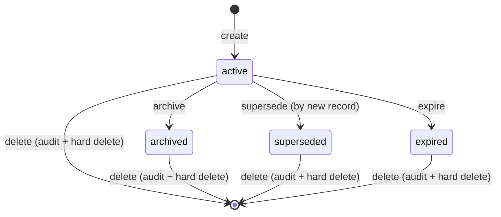

# Skills & Memory

Saivage agents reuse two complementary knowledge surfaces:

- **Skills** — durable procedural knowledge (how to do something). Skills
  are eagerly injected into agent system prompts based on triggers and
  role filters.
- **Memory** — situational facts and observations (what is true right
  now). Memory records can be fetched by id / topic or searched through
  the protected knowledge RAG dataset; targeted records can be eagerly
  injected like skills.

Both surfaces share the same SQLite sidecar, lifecycle state machine,
audit table, RAG reingest path, and MCP tool patterns. This page is the
conceptual / architectural reference. The full per-tool catalog (inputs,
error codes, per-role ACL) lives in [mcp/services](../mcp/services) §§6–7.

## 1. Records and scopes

Every skill and every memory is a Zod-validated `SkillRecord` /
`MemoryRecord`. The SQLite `record` row stores the serialized record in
`record_json`, the body in `body`, kind-specific lookup data in
`record_skill` / `record_memory`, audit rows in `audit`, and RAG sync
state in `rag_sync`. Records carry a **scope** that controls visibility
and lifetime:

| Scope     | Visible to               | Lifetime                              |
|-----------|--------------------------|---------------------------------------|
| `session` | One chat session         | Deleted when the session ends         |
| `stage`   | All agents in one stage  | Deleted when the stage is archived    |
| `project` | All agents, all stages   | Persists across stages and restarts   |

`scope_ref` points to the owning entity (`session_id`, `stage_id`, or
omitted for project scope). The canonical on-disk storage is one sidecar:

```
.saivage/
└── knowledge/
  └── store.sqlite
```

The retired `.saivage/skills` and `.saivage/memory` JSON trees are
legacy markers. Boot removes them when the sidecar already contains
records, or refuses to start with `KNOWLEDGE_MIGRATION_REQUIRED` when a
legacy tree exists and the sidecar is empty.

## 2. Built-in skills

Built-in skills ship inside the repository under `skills/builtin/<topic>/`:

```
skills/builtin/coding/
├── SKILL.md       # frontmatter + body
└── examples/      # optional supporting files
```

Built-in `SKILL.md` files are parsed through the strict
`BuiltinSkillFrontmatterSchema`. Unknown keys fail at startup. Global
built-ins must spell `target_agents: []` explicitly — there is no
implicit "global" default.

Frontmatter keys:

```yaml
name: coding
description: Best practices for writing and modifying code
triggers: [agent:coder, keyword:implement]
target_agents: [coder]
survive_compaction: false
```

At boot, `upsertBuiltinSkills` parses bundled `SKILL.md` files and
upserts them into `.saivage/knowledge/store.sqlite` as active
`origin = "builtin"` rows with stable ids of the form `builtin:<slug>`.
The eager loader reads built-ins from the sidecar; it no longer scans the
built-in skill tree at agent-start time. The source files remain
versioned with the code and refresh the sidecar copy on the next boot.

## 3. Project, stage, and session skills

Project / stage / session skills are **not** frontmatter files. They are
sidecar records authored through the MCP knowledge tools
(`create_skill`, `update_skill`, `supersede_skill`, `archive_skill`,
`delete_skill`). Manager may create and update skills; Manager and
Inspector may supersede, archive, and delete them. Coder, Researcher,
Data Agent, Reviewer, Designer, Critic, Chat, Librarian, and Planner
read/search skills but cannot write them.

Writes go through `src/knowledge/lifecycle.ts` on top of the SQLite
sidecar. Each mutation:

- Requires the runtime lock (`NO_RUNTIME_LOCK` if missing).
- Validates `reason`, scope / scope_ref, secret scans, and blocked-path
  guards before mutation.
- Performs record, kind side-table, and audit updates inside a sidecar
  transaction.
- Marks rows `pending_reingest = 1` and best-effort republishes the
  affected protected RAG dataset (`knowledge.skills` or
  `knowledge.memory`).

## 4. Memory tools

Memory mirrors the skill surface (`create_memory`, `update_memory`,
`supersede_memory`, `archive_memory`, `delete_memory`, `list_memories`,
`get_memory`, `search_memories`) with broader write access. Planner,
Manager, and Inspector own the full memory lifecycle. Coder and
Researcher may create/update memory only with `scope = "stage"` and
`scope_ref` equal to the active stage. Librarian may create/update only
project memory whose topic is `rag/policy`, `rag/secret-incidents`, or
`rag/drift-incidents`.

Data Agent has access to **skills only**, not memory.

See [mcp/services](../mcp/services) §§6–7 for the full ACL matrix.

## 5. Lifecycle state machine

Both skills and memories share the same status state machine:



- **active**: visible to readers, eligible for eager injection.
- **superseded**: hidden from readers by default; replaced by a newer
  record. Kept on disk for audit. `list_*` returns superseded records
  only when `include_superseded: true`.
- **archived**: hidden from readers by default; manually retired.
  `list_*` returns archived records only when `include_archived: true`.
- **expired**: a schema lifecycle state for time-based retirement.
- **deleted**: not a persisted status; delete appends an audit row and
  removes the sidecar record.

## 6. Triggers

Skill triggers are flat strings using `kind:value` syntax:

| Trigger kind | Matches when…                                 |
|--------------|-----------------------------------------------|
| `agent:<role>` | The current agent's role equals `<role>`    |
| `keyword:<word>` | The agent's prompt / task contains `<word>` after canonical normalization |
| `tag:<label>` | The agent's context carries `<label>` as a tag |

`tool:` and `path:` triggers were removed — they were
under-specified and over-promised. Triggerless skills are allowed:
non-survivor triggerless skills are not ordinary eager candidates, but
project-scope survivor records can still appear in survivor reinjection.
All active skills participate in `search_skills` and `read_skill` by id.

Canonical keyword normalization: NFC → lowercase → strip punctuation →
collapse whitespace. The same normalization runs on both trigger values
and the agent context.

## 7. Eager injection algorithm

When an agent starts a turn, the runtime calls
[`src/knowledge/eagerLoader.ts`](https://github.com/salva/saivage/blob/main/src/knowledge/eagerLoader.ts):

1. **`loadAllCandidates(projectRoot)`** opens
  `.saivage/knowledge/store.sqlite` and loads every active skill or
  memory row, including built-ins already upserted with
  `origin = "builtin"`.

2. **`resolveEagerRecords(candidates, role, context)`** filters and scores:
   - Drop records whose `status != "active"`.
   - Drop records whose `target_agents` is non-empty and does not include
     the current role.
   - Score skills against the trigger set:
     - `agent:<role>` matching the current role: high weight.
     - `tag:<label>` matching context tags: medium weight.
     - `keyword:<word>` matching a normalized context token: low weight.
   - Treat memories as eager-eligible only when they explicitly name
     `target_agents`.
   - Sort project records ahead of built-ins, then by score,
     `updated_at`, and `id` (stable ordering).

3. **Budget application** — two separate ceilings:
   - **Survivor pass** for project-scope records with
     `survive_compaction: true`. Survivors are summarized and
     re-injected after context compaction (see
     [runtime/compaction](../runtime/compaction)). The per-record
     survivor summary cap is 4096 estimated tokens; over-cap records are
     returned in `oversizedSurvivors` for the caller.
   - **Ordinary eager budget** for everything else.

4. **`formatEagerBlock(records)`** renders the selected records as
   labelled knowledge blocks appended to the agent's system prompt.

The implementation entry points:

- [`src/knowledge/eagerLoader.ts`](https://github.com/salva/saivage/blob/main/src/knowledge/eagerLoader.ts) — scoring + budgets + rendering.
- [`src/knowledge/loader.ts`](https://github.com/salva/saivage/blob/main/src/knowledge/loader.ts) — pure trigger scoring, search scoring helpers, survivor split, and redaction.
- [`src/knowledge/sidecar.ts`](https://github.com/salva/saivage/blob/main/src/knowledge/sidecar.ts) / [`src/knowledge/sidecar-queries.ts`](https://github.com/salva/saivage/blob/main/src/knowledge/sidecar-queries.ts) — SQLite schema, migrations, queries, and mutation primitives.
- [`src/knowledge/store.ts`](https://github.com/salva/saivage/blob/main/src/knowledge/store.ts) — error taxonomy and write-time guards.
- [`src/knowledge/lifecycle.ts`](https://github.com/salva/saivage/blob/main/src/knowledge/lifecycle.ts) — state-machine transitions.
- [`src/mcp/knowledgeSkills.ts`](https://github.com/salva/saivage/blob/main/src/mcp/knowledgeSkills.ts) / [`src/mcp/knowledgeMemory.ts`](https://github.com/salva/saivage/blob/main/src/mcp/knowledgeMemory.ts) — MCP tool adapters.

## 8. Survivor flag (`survive_compaction`)

`survive_compaction: true` opts a record into re-injection after the
agent's conversation has been compacted. This is the only mechanism that
guarantees long-running agents (especially Planner) carry knowledge
across compactions.

Guidance:

- **Project skills** that encode invariants the agent must always know
  should set `survive_compaction: true`. Keep these short — they
  compete for a tight per-record token cap.
- **Project memories** that the Planner needs to remember (lessons
  learned, persistent user preferences) should set the flag. The
  Planner-only pre-compaction nudge (see
  [runtime/compaction](../runtime/compaction)) gives Planner a chance to
  promote ephemeral facts to project memory before history is dropped.
- **Stage / session scope** never survives compaction regardless of the
  flag because survivor selection requires project scope. Stage/session
  knowledge is archived when that lifecycle closes.
- **Workers** can write only stage memory tied to the active stage. Such
  records do not survive compaction; promotion to project memory belongs
  to Manager / Planner / Inspector workflows.

## 9. Authoring conventions

**Skill bodies** are markdown. Keep them tight — every byte competes for
the eager-injection budget. Prefer a short rule list over prose. Examples
and exhaustive references belong in the source code or in the workspace
docs, not in skill bodies.

**Skill names** are kebab-case. Names are unique within a scope;
`NAME_COLLISION` is returned on conflict.

**Triggers**: prefer one `agent:<role>` trigger plus 1–3 specific
`keyword:` triggers. Avoid overly generic keywords (`code`, `test`,
`fix`) — they fire on too much context and dilute the budget. Tags are
useful for cross-cutting concerns (e.g. `tag:security`,
`tag:database-schema`).

**Memory bodies** should be self-contained — a reader without the
original task context should still understand what the fact says and
why it matters. Include the `_when_` and the `_why_`, not just the
_what_.

**`reason`** on every write is mandatory and is stored in the sidecar
audit row. Write something a reviewer will understand months later —
"fixed typo" is not useful; "renamed skill to match the agent role
taxonomy after the stage-scoped split" is.
