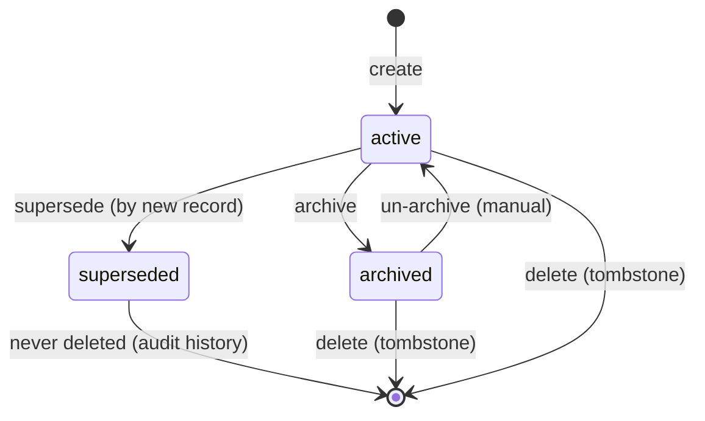

# Skills & Memory

Saivage agents reuse two complementary knowledge surfaces:

- **Skills** — durable procedural knowledge (how to do something). Skills
  are eagerly injected into agent system prompts based on triggers and
  role filters.
- **Memory** — situational facts and observations (what is true right
  now). Memory records are retrieved by topic / keyword when the agent
  asks for them; high-priority records can be eagerly injected like
  skills.

Both surfaces share the same on-disk layout, lifecycle state machine,
audit trail, and MCP tool patterns. This page is the conceptual /
architectural reference. The full per-tool catalog (inputs, error codes,
per-role ACL) lives in [mcp/services](../mcp/services) §§6–7.

## 1. Records and scopes

Every skill and every memory is a JSON record (`SkillRecord` /
`MemoryRecord`) plus a markdown body. Records carry a **scope** that
controls visibility and lifetime:

| Scope     | Visible to               | Lifetime                              |
|-----------|--------------------------|---------------------------------------|
| `session` | One chat session         | Deleted when the session ends         |
| `stage`   | All agents in one stage  | Deleted when the stage is archived    |
| `project` | All agents, all stages   | Persists across stages and restarts   |

`scope_ref` points to the owning entity (`session_id`, `stage_id`, or
omitted for project scope). The on-disk layout reflects this:

```
.saivage/
├── skills/
│   ├── project/
│   │   ├── <skill-id>.json
│   │   ├── <skill-id>.md
│   │   ├── index.json
│   │   └── audit.jsonl
│   ├── stages/<stage-id>/...
│   └── sessions/<session-id>/...
└── memory/
    ├── project/...
    ├── stages/<stage-id>/...
    └── sessions/<session-id>/...
```

The per-scope `index.json` is a projection of the active records'
summary fields (id, name, description, triggers, target_agents, status,
updated_at) and is rebuilt atomically on every write.

## 2. Built-in skills

Built-in skills ship inside the repository under `skills/builtin/<topic>/`:

```
skills/builtin/coding/
├── SKILL.md       # frontmatter + body
└── examples/      # optional supporting files
```

Built-in `SKILL.md` files are parsed through the strict
`BuiltinSkillFrontmatterSchema`. Unknown keys fail at startup. Global
built-ins must spell `target_agents: []` explicitly — there is no
implicit "global" default.

Frontmatter keys:

```yaml
name: coding
description: Best practices for writing and modifying code
triggers: [agent:coder, keyword:implement]
target_agents: [coder]
survive_compaction: false
```

Built-in skills are read-only at runtime — they cannot be archived,
superseded, or modified via the MCP tools. They are versioned with the
source code.

## 3. Project, stage, and session skills

Project / stage / session skills are **not** frontmatter files. They are
`SkillRecord` JSON documents authored by Manager and Inspector via the
MCP knowledge tools (`create_skill`, `update_skill`, `supersede_skill`,
`archive_skill`, `delete_skill`). Coder, Researcher, and Data Agent
**read** skills but cannot write them — they raise observations to the
Manager, who decides whether to materialize a skill.

Writes go through `src/knowledge/store.ts` which guarantees:

- Atomic write (temp-file + rename) for record + body + index.
- An `AuditEntry` appended to `audit.jsonl` for every write (creates,
  updates, supersessions, archives, deletes). The audit entry includes
  `reason`, which is mandatory — `EMPTY_REASON` rejects bare writes.
- Secret scan on body content; matches are redacted and counted.

## 4. Memory tools

Memory mirrors the skill surface (`create_memory`, `update_memory`,
`supersede_memory`, `archive_memory`, `delete_memory`, `list_memories`,
`get_memory`, `search_memories`) with one important ACL difference:
**Coder and Researcher may write memory** — but only with `scope =
"stage"` and `survive_compaction = false`. This lets workers capture
short-lived observations without polluting project memory. Manager,
Planner, and Inspector own the full memory lifecycle including project
scope and supersession.

Data Agent has access to **skills only**, not memory.

See [mcp/services](../mcp/services) §§6–7 for the full ACL matrix.

## 5. Lifecycle state machine

Both skills and memories share the same status state machine:



- **active**: visible to readers, eligible for eager injection.
- **superseded**: hidden from readers by default; replaced by a newer
  record. Kept on disk for audit. `list_*` returns superseded records
  only when `include_superseded: true`.
- **archived**: hidden from readers by default; manually retired.
  Reversible. `list_*` returns archived records only when
  `include_archived: true`.
- **deleted**: tombstone in `audit.jsonl`; body file removed from disk.

## 6. Triggers

Skill triggers are flat strings using `kind:value` syntax:

| Trigger kind | Matches when…                                 |
|--------------|-----------------------------------------------|
| `agent:<role>` | The current agent's role equals `<role>`    |
| `keyword:<word>` | The agent's prompt / task contains `<word>` after canonical normalization |
| `tag:<label>` | The agent's context carries `<label>` as a tag |

`tool:` and `path:` triggers were removed — they were
under-specified and over-promised. Triggerless skills are allowed: they
are never eager-injected but participate in `search_skills` and
`read_skill` by id.

Canonical keyword normalization: NFC → lowercase → strip punctuation →
collapse whitespace. The same normalization runs on both trigger values
and the agent context.

## 7. Eager injection algorithm

When an agent starts a turn, the runtime calls
[`src/knowledge/eagerLoader.ts`](https://github.com/salva/saivage/blob/main/src/knowledge/eagerLoader.ts):

1. **`loadAllCandidates(projectRoot)`** collects:
   - Project records from `.saivage/{skills,memory}/{project,stages,sessions}/`.
   - Built-in skills from `skills/builtin/<topic>/SKILL.md`.

2. **`resolveEagerRecords(candidates, role, context)`** filters and scores:
   - Drop records whose `status != "active"`.
   - Drop records whose `target_agents` is non-empty and does not include
     the current role.
   - Score skills against the trigger set:
     - `agent:<role>` matching the current role: high weight.
     - `keyword:<word>` matching the context: medium weight.
     - `tag:<label>` matching context tags: medium weight.
   - Sort by score, then by `updated_at`, then by `id` (stable ordering).

3. **Budget application** — two separate ceilings:
   - **Survivor budget** for records with `survive_compaction: true`.
     Survivors are re-injected after context compaction (see
     [runtime/compaction](../runtime/compaction)). The per-record hard
     cap is 4096 tokens; records exceeding the cap are quarantined but
     their ids are listed in the survivor block header
     (`oversized_survivors: [...]`) so the agent can reach them via
     `read_skill` / `get_memory`.
   - **Ordinary eager budget** for everything else.

4. **`formatEagerBlock(records)`** renders the selected records as
   labelled knowledge blocks appended to the agent's system prompt.

The implementation entry points:

- [`src/knowledge/eagerLoader.ts`](https://github.com/salva/saivage/blob/main/src/knowledge/eagerLoader.ts) — scoring + budgets + rendering.
- [`src/knowledge/loader.ts`](https://github.com/salva/saivage/blob/main/src/knowledge/loader.ts) — candidate enumeration.
- [`src/knowledge/store.ts`](https://github.com/salva/saivage/blob/main/src/knowledge/store.ts) — atomic record / body / index writes + audit.
- [`src/knowledge/lifecycle.ts`](https://github.com/salva/saivage/blob/main/src/knowledge/lifecycle.ts) — state-machine transitions.
- [`src/mcp/knowledgeSkills.ts`](https://github.com/salva/saivage/blob/main/src/mcp/knowledgeSkills.ts) / [`src/mcp/knowledgeMemory.ts`](https://github.com/salva/saivage/blob/main/src/mcp/knowledgeMemory.ts) — MCP tool adapters.

## 8. Survivor flag (`survive_compaction`)

`survive_compaction: true` opts a record into re-injection after the
agent's conversation has been compacted. This is the only mechanism that
guarantees long-running agents (especially Planner) carry knowledge
across compactions.

Guidance:

- **Project skills** that encode invariants the agent must always know
  should set `survive_compaction: true`. Keep these short — they
  compete for a tight per-record token cap.
- **Project memories** that the Planner needs to remember (lessons
  learned, persistent user preferences) should set the flag. The
  Planner-only pre-compaction nudge (see
  [runtime/compaction](../runtime/compaction)) gives Planner a chance to
  promote ephemeral facts to project memory before history is dropped.
- **Stage / session scope** never survives compaction regardless of the
  flag (the record itself is deleted with the stage / session).
- **Workers** can write stage memory only with
  `survive_compaction: false` (enforced by ACL). They cannot promote
  observations to long-term memory; that is the Manager / Planner role.

## 9. Authoring conventions

**Skill bodies** are markdown. Keep them tight — every byte competes for
the eager-injection budget. Prefer a short rule list over prose. Examples
and exhaustive references belong in the source code or in the workspace
docs, not in skill bodies.

**Skill names** are kebab-case. Names are unique within a scope;
`NAME_COLLISION` is returned on conflict.

**Triggers**: prefer one `agent:<role>` trigger plus 1–3 specific
`keyword:` triggers. Avoid overly generic keywords (`code`, `test`,
`fix`) — they fire on too much context and dilute the budget. Tags are
useful for cross-cutting concerns (e.g. `tag:security`,
`tag:database-schema`).

**Memory bodies** should be self-contained — a reader without the
original task context should still understand what the fact says and
why it matters. Include the `_when_` and the `_why_`, not just the
_what_.

**`reason`** on every write is mandatory and is what shows up in audit
log inspection. Write something a reviewer will understand months
later — "fixed typo" is not useful; "renamed skill to match the
agent role taxonomy after the stage-scoped split" is.
