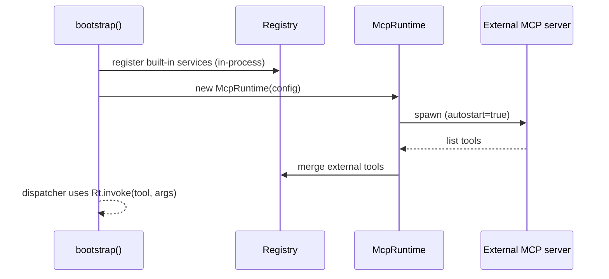

# MCP Runtime

[`src/mcp/runtime.ts`](https://github.com/salva/saivage/blob/main/src/mcp/runtime.ts) ·
[`src/mcp/registry.ts`](https://github.com/salva/saivage/blob/main/src/mcp/registry.ts) ·
[`src/mcp/client.ts`](https://github.com/salva/saivage/blob/main/src/mcp/client.ts)

Saivage exposes tools to agents through the **Model Context Protocol**
(MCP). The MCP runtime sits between the agent and concrete tool
implementations and supports two service flavors:

- **In-process services** — registered as a `(toolName, args) → result`
  handler. Used by every built-in (filesystem, shell, git, plan, notes,
  skills).
- **External servers** — long-running subprocesses speaking MCP over
  stdio (or remote over SSE). Configured under `mcpServers` in
  `saivage.json`. Used for things like Playwright that bring large native
  dependencies.

## Registry

`McpRuntime` keeps a registry of services and their tools.
`listRegisteredServices()` powers the `/api/state` endpoint's MCP panel.

Each tool entry includes:

- `name` — the public tool id (e.g. `read_file`).
- `description` — surfaced to the LLM.
- `inputSchema` — JSON Schema; the agent's tool call is validated against
  it before dispatch.
- `service` — origin service id.

## Lifecycle



External servers use `McpClient` to connect (stdio or SSE), perform the
MCP handshake, list tools, and forward calls. Failures during connection
mark the service `unavailable` and remove its tools from the catalog;
agents will not see those tools.

## Invocation

```ts
const result = await runtime.invoke("read_file", { path: "src/index.ts" });
```

The runtime:

1. Looks up the tool in the registry.
2. If the service is in-process, calls the handler synchronously
   (still async for I/O).
3. If external, sends a `tools/call` request over the MCP transport and
   awaits the response.
4. Returns `{ content, isError }`.

## Health & autostart

- `runtime.maxServices` caps the number of services the runtime will
  manage.
- Crashed external servers are restarted automatically when
  `runtime.restartOnCrash` is true.
- A periodic `healthCheckIntervalMs` ping verifies that long-running
  services still respond.

## Adding a service

### In-process

```ts
runtime.registerInProcess("my-svc", tools, async (name, args) => {
  switch (name) {
    case "do_thing": return { content: doThing(args), isError: false };
    default: return { content: `unknown tool ${name}`, isError: true };
  }
});
```

### External

Add to `saivage.json`:

```jsonc
"mcpServers": {
  "playwright": {
    "command": "npx",
    "args": ["-y", "@playwright/mcp@latest", "--headless"],
    "transport": "stdio",
    "autostart": true
  }
}
```

The runtime will spawn it on boot.
