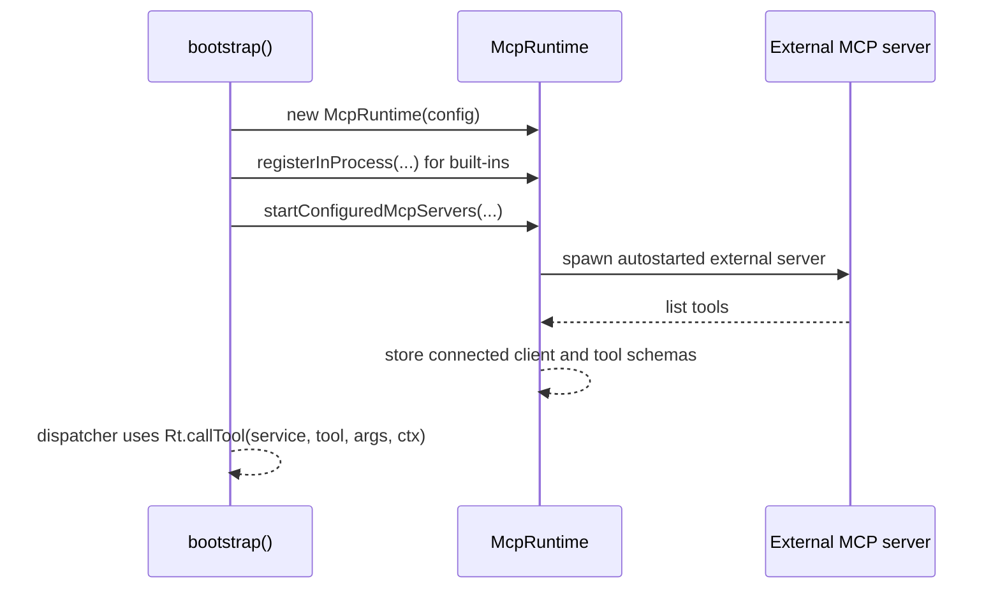

# MCP Runtime

[`src/mcp/runtime.ts`](https://github.com/salva/saivage/blob/main/src/mcp/runtime.ts) ·
[`src/mcp/client.ts`](https://github.com/salva/saivage/blob/main/src/mcp/client.ts) ·
[`src/mcp/toolContext.ts`](https://github.com/salva/saivage/blob/main/src/mcp/toolContext.ts)

Saivage exposes tools to agents through the **Model Context Protocol**
(MCP). The MCP runtime sits between the agent and concrete tool
implementations and supports two service flavors:

- **In-process services** — registered as a `(toolName, args, ctx?) → result`
  handler. Used by built-ins such as filesystem, shell, data, git, plan,
  notes, skills, memory, and rag.
- **External servers** — long-running subprocesses speaking MCP over
  stdio through `McpClient`. Configured under `mcpServers` in
  `saivage.json`. The config schema accepts a `transport` field, but the
  current client implementation instantiates `StdioClientTransport`.

## Registry

`McpRuntime` keeps two in-memory maps: in-process services and running
external services. `getAllTools()` returns only currently available tools
for agent schemas, while `listAllToolsForApi()` also includes unavailable
in-process stubs with `available: false` for API discovery.

Each tool entry includes:

- `name` — the public tool id (e.g. `read_file`).
- `description` — surfaced to the LLM.
- `inputSchema` — JSON Schema surfaced to the LLM and API clients; the MCP
  runtime itself does not validate schemas before dispatch.
- `service` — origin service id.

## Lifecycle



External servers use `McpClient` to connect over stdio, perform the MCP
handshake, list tools, and forward calls. `bootstrap()` starts only entries
with `disabled: false` and `autostart: true`; connection failures are
logged and the service is not added to the running-service map, so agents
do not see its tools.

## Invocation

```ts
const result = await runtime.callTool("filesystem", "read_file", {
  path: "src/index.ts",
}, toolContext);
```

The runtime:

1. Checks whether `serviceName` is registered as an in-process service.
2. If the service is in-process and available, calls the async handler with
  the optional `ToolCallContext` and races it against `mcp.inProcessTimeoutMs`
  or `mcp.shellTimeoutMs` for the shell service.
3. If external, fetches the already-running client and sends a `tools/call`
  request over the MCP transport, then marks the service active for idle
  tracking.
4. If the tool result has `isError: true`, throws an error containing the
  result content.
5. Otherwise returns `content`.

`ToolCallContext` carries the caller role, agent id, project root, and
optional stage/channel/session ids. Knowledge and RAG handlers use it for
authorization and audit attribution; external MCP subprocesses ignore it.
   awaits the response.
## Health & autostart

- Crashed or disconnected external servers are restarted during health
  checks when `runtime.restartOnCrash` is true.
- A periodic `healthCheckIntervalMs` ping verifies that long-running
  services still respond.
- `idleShutdownMs` stops external services that have been inactive longer
  than the configured idle window.
- Repeated external startup failures are tracked in a short failure window;
  once the threshold is reached, the service enters cooldown and is removed
  from the running-service map.

## Adding a service

### In-process

```ts
runtime.registerInProcess("my-svc", tools, async (name, args) => {
  switch (name) {
    case "do_thing": return { content: doThing(args), isError: false };
    default: return { content: `unknown tool ${name}`, isError: true };
  }
});
```

### External

Add to `saivage.json`:

```jsonc
"mcpServers": {
  "playwright": {
    "command": "npx",
    "args": ["-y", "@playwright/mcp@latest", "--headless"],
    "transport": "stdio",
    "autostart": true
  }
}
```

The runtime will spawn it on boot.
