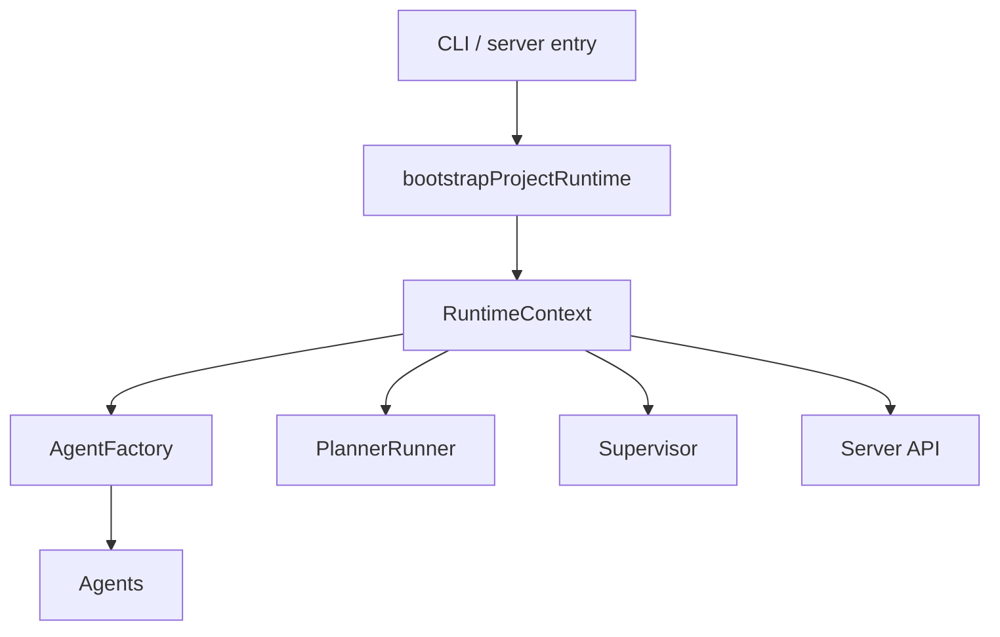

# Runtime Kernel Split

## Problem

`src/server/bootstrap.ts` is both the composition root and a large part of the
runtime kernel. It discovers projects, loads config, initializes providers,
constructs RAG and knowledge services, registers MCP tools, runs recovery,
manages runtime locks, constructs child agents, owns Planner restarts, publishes
events, installs fatal handlers, and starts the supervisor.

This makes the actual runtime hard to understand and hard to test without a full
server-like environment.

## Goal

Make bootstrap boring by extracting the genuinely complex runtime behavior. Do
not replace a partially decomposed file with a large lifecycle framework unless
the code proves it needs one.

## Target Components

### `RuntimeKernel` Optional

Only introduce this if the targeted extractions below still leave lifecycle
state scattered. If needed, it owns process-local runtime lifecycle:

- Start and stop runtime services.
- Hold the active `RuntimeContext`.
- Own agent registry and runtime tracker.
- Own Planner restart queue.
- Own shutdown handoff and fatal-state writing.

### `RuntimeContext`

Immutable or mostly immutable dependency bag:

- `project`
- `config`
- `router`
- `routing`
- `mcpRuntime`
- `eventBus`
- `planService`
- `noteManager`
- `knowledgeStore`
- `ragService`

### `AgentFactory`

Constructs agents and child spawners:

- Resolves model route for role.
- Builds `AgentContext`.
- Applies stage-scoped worker cache (reviewer, designer, critic are reused within
  a stage instead of re-created for each dispatch).
- Registers/unregisters active agents in the tracker.

This is the only function that knows about all agent types, making it the
highest-value extraction target from bootstrap.

### `PlannerRunner`

Owns Planner loops:

- Single Planner run.
- Recovery loop.
- Explicit restart handling.
- Continuous-improvement directive injection.

### `ServiceBootstrapper` Optional

Only introduce this if provider/MCP/RAG/knowledge startup remains hard to test
after `AgentFactory` and `PlannerRunner` are extracted. If needed, it initializes
infrastructure:

- Provider router.
- MCP runtime and built-ins.
- External MCP autostart.
- RAG manager.
- Knowledge store.
- Plan and notes services.

## Runtime Flow

Note: `RuntimeKernel` and `ServiceBootstrapper` are optional. Introduce them only
if the targeted AgentFactory and PlannerRunner extractions leave lifecycle state
that cannot be tested or understood without a wrapper.

## Design Rules

- Bootstrap may wire dependencies, but should not contain agent-spawning logic.
- If a `RuntimeKernel` is introduced, it may own lifecycle, but should not know
  role-specific prompt construction.
- AgentFactory may create agents, but should not own Planner recovery policy.
- PlannerRunner may decide when to restart Planner, but should not initialize
  providers, RAG, or MCP.
- Server routes should receive a runtime facade, not the mutable kernel internals.

## Migration Strategy

1. Extract `createChildSpawner` into `AgentFactory` first; it is the largest
   behavior block inside bootstrap.
2. Extract Planner recovery loop into `PlannerRunner`.
3. Keep existing small helpers in bootstrap when they are already named and
   understandable.
4. Introduce `RuntimeKernel` or `ServiceBootstrapper` only if the smaller
   extractions leave a concrete lifecycle/testing problem.
5. Keep public exports stable until call sites are migrated, then delete old
   glue.

## Validation

- Unit-test `AgentFactory` with fake agents and fake tracker.
- Unit-test `PlannerRunner` with a stub Planner result sequence.
- If `RuntimeKernel` is introduced, unit-test `RuntimeKernel.shutdown()` with
  fake services and assert shutdown order.
- Run `npm run typecheck`, `npm test`, and `npm run build`.

## Expected Result

The runtime can be reasoned about as bootstrap composition plus two focused
runtime behavior owners: one for agent construction and one for Planner recovery.
More framework should be added only if those seams are insufficient.
