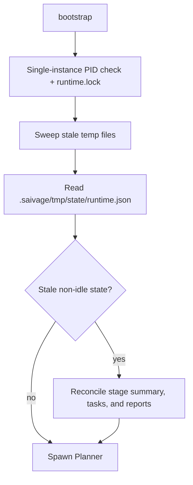

# Abort & Recovery

Two related mechanisms ensure the runtime survives unexpected events:

- **Abort / cancellation** ([`src/runtime/abort.ts`](https://github.com/salva/saivage/blob/main/src/runtime/abort.ts))
  — helper primitives plus the live `BaseAgent.cancel()` / abort-signal
  paths used by planner restart, shutdown, and supervisor cancellation.
- **Recovery** ([`src/runtime/recovery.ts`](https://github.com/salva/saivage/blob/main/src/runtime/recovery.ts))
  — startup-time reconciliation of disk state after a crash.

## Abort

### Trigger sources

- **Planner restart request** — `PlannerControl` sets the Planner's
  abort signal and queues a restart directive.
- **Process shutdown** — the signal handler cancels the active Planner.
- **Supervisor decision** — see [Supervisor](./supervisor); it calls
  `cancel()` on the selected abortable agent.

`abort.ts` still exposes `scanForUrgentNotes`, `triggerAbort`, and
`resetWorkingTree`, but the current runtime does not wire urgent notes into
active-work interruption. Chat-created urgent notes are high-priority
Planner input, not automatic aborts.

### Procedure

1. `BaseAgent.runLoop()` checks the supplied abort signal and the agent's
  `cancelled` flag before LLM calls, before/after tool dispatch, and
  during retry sleeps.
2. Workers map `finishReason: "abort" | "cancelled"` to an `AgentResult`
  with `kind: "abort"` and a partial failed `TaskReport`.
3. Manager maps the same finish reasons to `kind: "abort"` with a partial
  `StageSummary` whose `result` is `"aborted"`.
4. Planner maps the finish reason to `kind: "abort"`; the recovery loop
  stops on a Planner abort.
5. Supervisor cancellation targets one active abortable agent and reissues
  `cancel()` after `forceCancelDelayMs` if the agent remains registered.

### Files preserved across abort

- Anything already persisted under `.saivage/`.
- Untracked files anywhere in the working tree.
- Committed work — cancellation never rewrites history.

### Files lost across abort

- Worker-process LLM conversation memory (workers are one-shot; never
  durable).

There is no live automatic rollback path that invokes `git checkout -- .`;
tracked modified files are not reset by cancellation unless some future
caller wires `resetWorkingTree()` into the runtime.

## Recovery

Triggered by `bootstrap()` on every startup after the single-instance
PID check and `runtime.lock` acquisition.

A "stale PID" is a runtime state that is not `"idle"` and whose PID guard
does not prove another live instance owns it. Recovery does not archive
`runtime.json`; it reconciles persisted stage/task files and lets the new
runtime tracker write fresh state.

`Recovery` also:

- Resets `tasks.json` entries with `status: "in-progress"` to `"pending"`
  for every active stage (so the next Manager redispatches them).
- Sweeps stale `*.tmp` files in `.saivage/tmp/state/` and the project
  `.saivage/` root (`sweepStaleTempFiles` in `src/store/documents.ts`).

Shutdown handoff is consumed separately by `bootstrap()` via
`consumeShutdownHandoff(project)` and queued as a Planner startup directive
— see [Supervisor & Shutdown Handoff](./supervisor).
