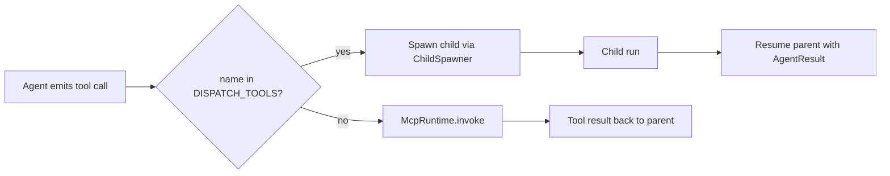

# Dispatcher & Suspend/Resume

[`src/runtime/dispatcher.ts`](https://github.com/salva/saivage/blob/main/src/runtime/dispatcher.ts)
· details [`runtime/details`](./details)

The Dispatcher is the heart of the runtime. It implements the
**suspend / resume / nested-tool-call** pattern that makes the agent
hierarchy possible.

## Dispatch tools

```ts
const DISPATCH_TOOLS = new Set([
  "run_manager",
  "run_coder",
  "run_researcher",
  "run_data_agent",
  "run_reviewer",
  "run_designer",
  "run_critic",
  "run_inspector",
  "run_librarian",
]);
```

When the model emits a tool call whose name is in this set, the
Dispatcher does **not** route it to the MCP runtime. Instead it:

1. Suspends the parent agent's conversation in memory; the current assistant tool-use message is already part of `BaseAgent.messages`.
2. Resolves the child role from the tool name.
3. Spawns a fresh `BaseAgent` instance for the child via the
   `ChildSpawner` callback (provided by `bootstrap()`).
4. Awaits the child's `run()`.
5. Resumes the parent: appends the child's `AgentResult` as a tool result
   message, continues the conversation loop.

## Parallel dispatch

If the parent emits **multiple** dispatch tool calls in a single LLM
response, the Dispatcher schedules the allowed calls concurrently:

- One Coder + one Researcher → both run.
- Two Coders → second is rejected with an error tool result.
- Non-worker dispatches such as Inspector or Librarian are not duplicate
  limited by `Dispatcher.enforceDispatchLimits`.

The parent resumes after the dispatch batch completes. The Dispatcher's
`Promise.all` result is appended as one tool-result message, so the next
parent LLM call sees the full completed batch.

## Stash

[`src/runtime/stash.ts`](https://github.com/salva/saivage/blob/main/src/runtime/stash.ts)
provides a disk-backed scratchpad for oversized tool results. `BaseAgent`
stashes any tool result whose token estimate exceeds 5% of the model
context window, and the Dispatcher exposes a synthetic `read_stash` local
tool so the model can read portions of that file later.

## Notes injection on resume

Notes are not injected by the Dispatcher. The Planner owns a `NoteChannel`
input channel backed by `NoteManager`; `BaseAgent.drainChannels()` pulls
deliverable notes immediately before each Planner `router.chat` call and
injects them as user-role messages.

## Tool routing summary



## Errors

If a child throws, the Dispatcher wraps the error into a tool result with
`is_error: true` and resumes the parent. The parent's prompt instructs it
to evaluate the error and decide whether to retry, escalate, or adjust.

If `ChildSpawner` itself fails (e.g. provider initialization), the
Dispatcher catches the error and returns an `is_error: true` tool result
for that dispatch call.
