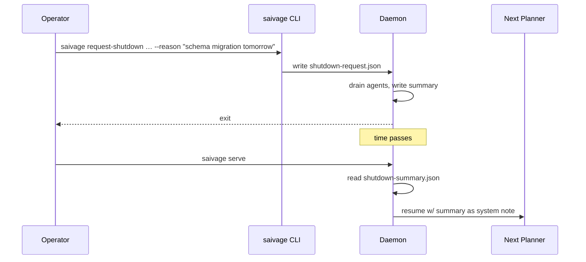

# Supervisor & Shutdown Handoff

[`src/runtime/supervisor.ts`](https://github.com/salva/saivage/blob/main/src/runtime/supervisor.ts) ·
[`src/runtime/shutdown-handoff.ts`](https://github.com/salva/saivage/blob/main/src/runtime/shutdown-handoff.ts)

## Supervisor

The Supervisor is a **periodic background loop** that monitors the daemon's
health from the outside. It is independent of the agent hierarchy.

### What it does

Every `intervalMs` (default 20 minutes):

1. Read the last `logLines` (default 400) from the structured log.
2. Build a prompt summarizing recent agent activity.
3. Call a (typically cheaper) model with that prompt and ask:
   *"Is the agent making progress? Yes / no, with confidence and reason."*
4. Append the verdict to the runtime's verdict ring buffer.

After `consecutiveStuckVerdicts` (default 3) consecutive *stuck* verdicts
the Supervisor:

- Picks the deepest active worker by `ROLE_ABORT_PRIORITY`
  (`reviewer → data_agent → coder → researcher → manager`).
- Calls `runtime.abort(supervisorReason)` to trigger the [Abort](./abort-recovery)
  flow.
- Logs a verdict `"forced_abort"`. If after `FORCE_CANCEL_DELAY_MS`
  (10 min) the agent hasn't terminated, it re-issues the abort.

### Configuration

```jsonc
"supervisor": {
  "enabled": true,
  "model":   "github-copilot/gpt-5.4",
  "intervalMs": 1200000,
  "consecutiveStuckVerdicts": 3,
  "logLines": 400
}
```

### When to disable

For development or short-running tasks. With `enabled: false`, the loop
never runs and stuck detection falls entirely to in-agent self-check +
compaction limits.

## Shutdown Handoff

A graceful shutdown wants to communicate **why** to the next session.
Handoff serializes a structured reason and a snapshot of relevant state.

### Files involved

| File | Written by | Read by |
|------|------------|---------|
| `.saivage/tmp/state/shutdown-request.json` | `request-shutdown` CLI / API | Daemon's signal handler. |
| `.saivage/tmp/state/shutdown-summary.json` | Daemon during shutdown | Recovery on next startup. |

### Lifecycle



`ShutdownSummarySchema` captures: reason, who requested it, plan snapshot,
in-flight agents, and the timestamp. The Planner sees the summary as a
system message at the start of its conversation.

### Triggering

```bash
saivage request-shutdown ./project --reason "Switching providers tomorrow"
saivage request-shutdown ./project --reason-stdin <<<"reason"
```

The daemon's signal handler watches for the request file and initiates
graceful shutdown — agents finish their current tool round, write their
summaries, and exit cleanly.
