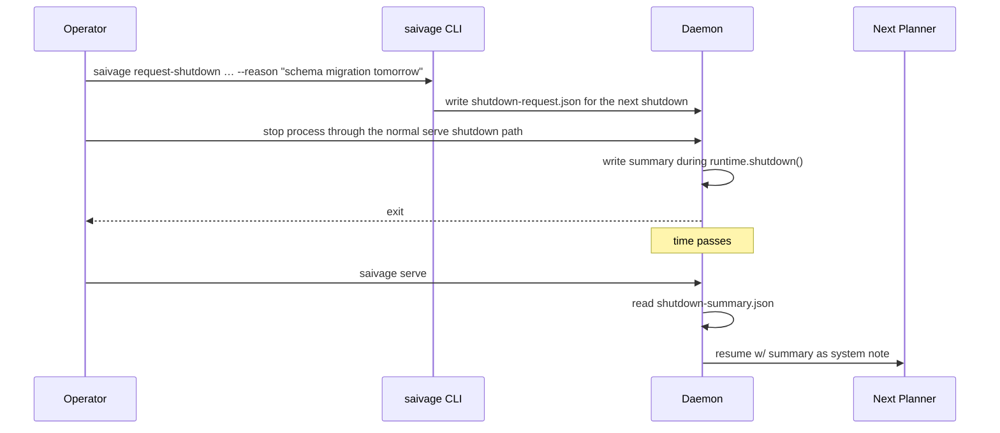

# Supervisor & Shutdown Handoff

[`src/runtime/supervisor.ts`](https://github.com/salva/saivage/blob/main/src/runtime/supervisor.ts) ·
[`src/runtime/shutdown-handoff.ts`](https://github.com/salva/saivage/blob/main/src/runtime/shutdown-handoff.ts)

## Supervisor

The Supervisor is a **periodic background loop** that monitors the daemon's
health from the outside. It is independent of the agent hierarchy.

### What it does

Every `intervalMs` (default 20 minutes):

1. Read the last `logLines` (default 400) from the structured log.
2. Build a prompt summarizing recent agent activity.
3. Call a (typically cheaper) model with that prompt and ask:
   *"Is the agent making progress? Yes / no, with confidence and reason."*
4. Update the in-memory consecutive-stuck counter and log the verdict.

After `consecutiveStuckVerdicts` (default 3) consecutive *stuck* verdicts
the Supervisor:

- Picks the active registered agent with the lowest roster abort priority:
  Reviewer, Critic, Data Agent, Coder, Researcher, Designer, Manager,
  then Librarian. Planner, Inspector, and Chat are not abortable by the
  Supervisor.
- Calls `cancel()` on that agent; see [Abort & Recovery](./abort-recovery)
  for the cancellation mapping.
- If after `forceCancelDelayMs` (default 10 min) the agent remains
  registered, it calls `cancel()` again.

### Configuration

```jsonc
"supervisor": {
  "enabled": true,
  "model":   "provider/model",
  "intervalMs": 1200000,
  "consecutiveStuckVerdicts": 3,
  "logLines": 400,
  "forceCancelDelayMs": 600000
}
```

When `enabled` is true, a supervisor model must be configured either via
`supervisor.model` or project routing for the `supervisor` role.

### When to disable

For development or short-running tasks. With `enabled: false`, the loop
never runs and stuck detection falls entirely to in-agent self-check +
compaction limits.

## Shutdown Handoff

A graceful shutdown wants to communicate **why** to the next session.
Handoff serializes a structured reason and a snapshot of relevant state.

### Files involved

| File | Written by | Read by |
|------|------------|---------|
| `.saivage/tmp/state/shutdown-request.json` | `request-shutdown` CLI / API | `writeShutdownSummary()` during daemon shutdown. |
| `.saivage/tmp/state/shutdown-summary.json` | Daemon during shutdown | `consumeShutdownHandoff()` on next startup. |

### Lifecycle



`ShutdownSummarySchema` captures: reason, who requested it, plan snapshot,
in-flight agents, and the timestamp. The Planner sees the summary as a
system message at the start of its conversation.

### Triggering

```bash
saivage request-shutdown ./project --reason "Switching providers tomorrow"
saivage request-shutdown ./project --reason-stdin <<<"reason"
```

`request-shutdown` records the reason; it does not signal or stop the
daemon by itself. The serve process writes the summary when its normal
shutdown path calls `runtime.shutdown()`, and that summary is consumed on
the next startup as a Planner directive.
